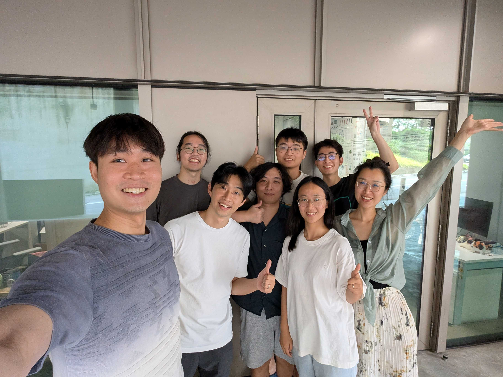
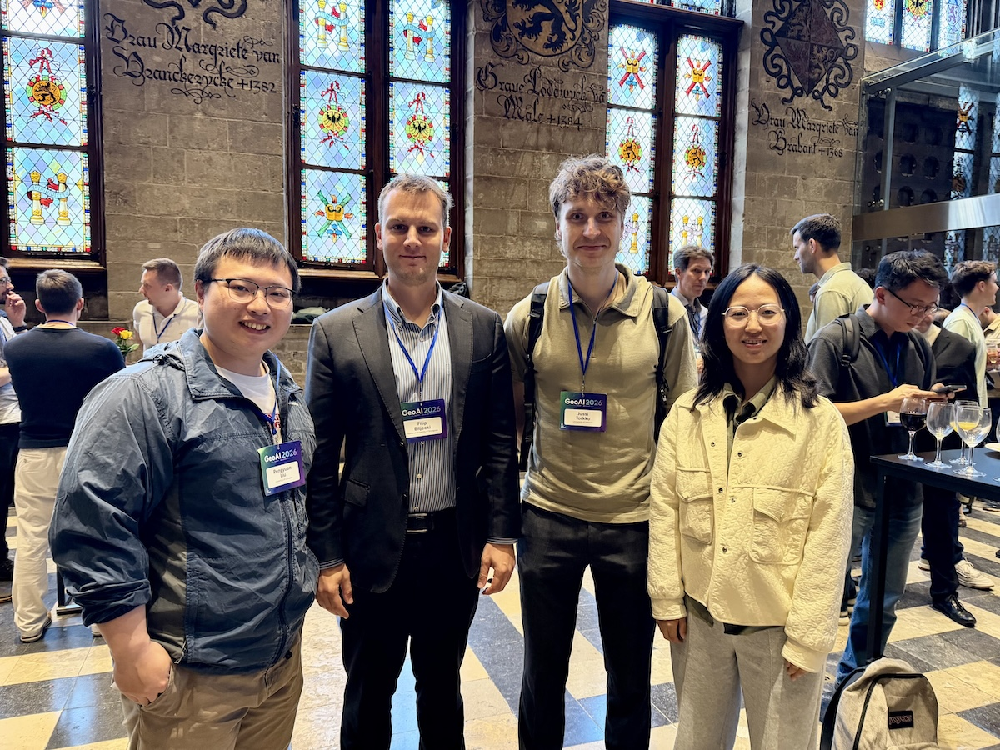
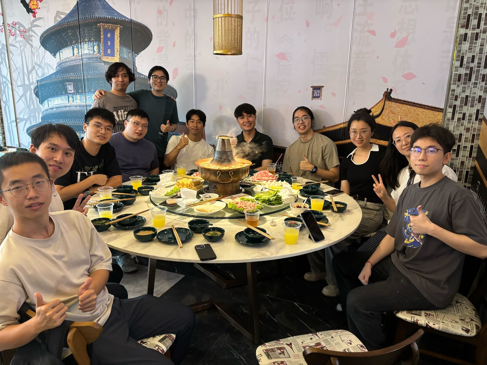
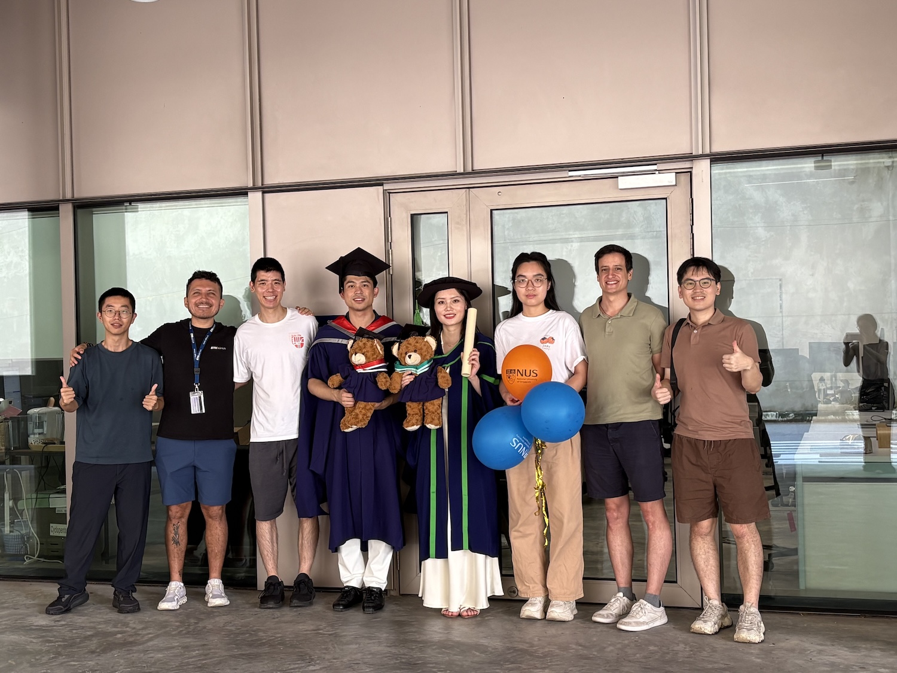

+++
# About widget.
widget = "blank"  # See https://sourcethemes.com/academic/docs/page-builder/
headless = false  # This file represents a page section.
active = true  # Activate this widget? true/false
weight = 20  # Order that this section will appear in.

title = "About the Urban Analytics Lab"
#subtitle = "Subtitle"
[design]
  # Choose how many columns the section has. Valid values: 1 or 2.
  columns = "1"
+++

We are a multidisciplinary research group focusing on urban data management and analysis, geographic data science, and digital twins at the [Department of Architecture](https://cde.nus.edu.sg/arch/) of the [National University of Singapore (NUS)](http://www.nus.edu.sg), a leading global university centred in Asia.

In a nutshell, we are developing quantitative methods and tools that leverage emerging geospatial data and AI to sense the form, function, and human experience of cities.
While doing that, we are also developing foundational research to support urban informatics such as means to understanding data quality and integrity.

In our mission to leverage and make sense of big geospatial data at different scales for urban applications, we are particularly interested in the interface of emerging urban datasets such as street-level imagery, online reviews and dynamic/sensor data with the state of the art of artificial intelligence to solve urban challenges and take urban informatics forward.
Our research catalyses the development of spatial/urban data infrastructures and digital twins under the umbrella of smart cities and the built environment, as evidenced through its adoption by international organisations, governments, and industry.

Crowdsourcing and user-generated information play an important role in our research, as we follow and contribute to the vibrant developments in Volunteered Geographic Information (VGI) and tend to engage such data in our innovations.

The research group was established in 2019 by its Director/PI Dr {}, Associate Professor at the [NUS College of Design and Engineering](https://www.cde.nus.edu.sg) and the [NUS Business School](https://bschool.nus.edu.sg), and has been a home for [dozens of remarkable researchers](/people) who share ambitions about making our cities smarter and more data-driven.
You can read more about our research agenda also in [an interview with the PI](https://news.nus.edu.sg/creating-a-map-for-the-future).

Within NUS and Singapore, we collaborate primarily with several sister labs such as the [Building and Urban Data Science (BUDS) Lab](https://www.budslab.org), the [Integrated Data, Energy Analysis + Simulation (IDEAS) Lab](https://ideaslab.io), the [Behavioural Cognitive Science (BeCoS) Lab](https://behaviourscience.org), the [City Syntax Lab](https://www.citysyntax.io), and the [Urban Climate Design Lab (UCDL)](https://www.sde.nus.edu.sg/arch/ucdl/), forging a constellation of research groups with complementary agendas operating at converging scales and with shared objectives.

Besides funding from NUS and academic/government organisations such as Singapore's Ministry of Education, we also received support from industry, e.g. [Takenaka Corporation from Japan]().

In 2026, we reached a milestone of 100 lab members (alumni + current), and we have [graduated our first PhDs](/doctors).
Some photos of our vibrant and multidisciplinary team over the years are below.

## Our culture

Ours is a small and friendly team with a flat hierarchy, where ideas are discussed on their merit rather than by seniority.
Most of us pursue our own projects, such as a PhD or a postdoctoral line of research, so each researcher takes full ownership of their work: setting the direction, making the methodological choices, and standing behind the results.
At the same time, collaboration is the norm rather than the exception, and our members regularly join forces on papers, share code and datasets, and help each other with methods, writing, and presenting.

We are a multidisciplinary and international group, and we find that many of our better ideas come from that mix of backgrounds and perspectives.
We care about the quality and impact of our research rather than counting papers, and we take open science seriously, releasing our [data and code](/data-code) and documenting our work so that others can build on it.
And while everyone here is busy and works hard, we always find time for lunches, dinners, and the occasional outing.

Some of our activities are also featured in a recent [video](https://www.youtube.com/watch?v=rOgbqANG-6I):


If you are looking for a paper that overviews our work, this [2023 book chapter](/publication/2023-geoai-handbook-urban-sensing/), part of the [Handbook of Geospatial Artificial Intelligence](https://www.taylorfrancis.com/books/edit/10.1201/9781003308423/handbook-geospatial-artificial-intelligence-song-gao-yingjie-hu-wenwen-li), describes a portion of our research agenda and recent work.

You are welcome to follow our work through <a itemprop="sameAs" href="https://www.linkedin.com/company/urban-analytics-lab/" target="_blank" rel="noopener"><i class="fab fa-linkedin"></i> LinkedIn</a>, <a href="../post/">blog</a>, and <a href="../publication/">papers</a>.
You may also be interested in our home-grown data and code that we [released openly](/data-code).

The full list of our interests and key words: Urban Informatics, Urban Analytics, Urban AI, Geographical Information Science (GIS), geospatial machine learning, GeoAI, geographic data science, spatial data infrastructure (SDI), 3D city modelling / 3D GIS / digital twins, street view imagery, spatial data quality and standardisation, thermography, Volunteered geoinformation (VGI) and OpenStreetMap (OSM), Building Information modelling (BIM).

Check out also some other videos about our work:



 



