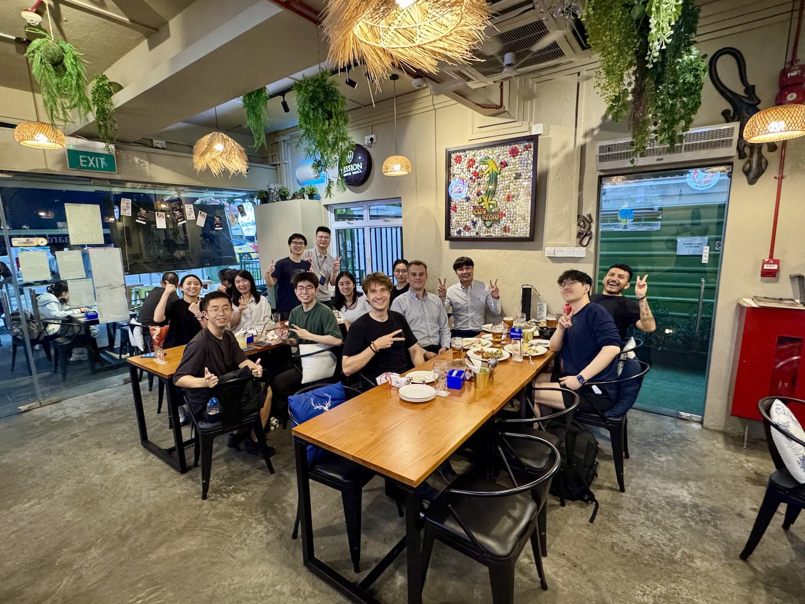
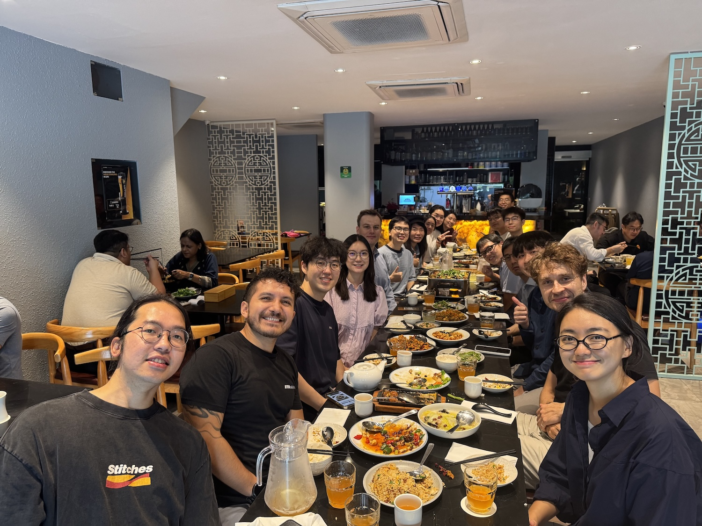

We are proud of our graduates and grateful for their role in growing and shaping our research group.
On this website, we feature PhD graduates who have conducted their doctoral research in our group.

| Graduate  | Defended | Thesis                                      |
|-----------|----------|---------------------------------------------|
| [Binyu Lei](https://binyulei.github.io/) | Oct 2025 | Urban Digital Twins: From Conceptualisation to Adoption Through a Human-Centric Lens |
| [Winston Yap](https://www.winstonyym.com) | Nov 2025 | Urban Graph Analytics: Connecting Cities, Data, and People |
|           |          |                                             |

---

## Dr Winston Yap (2025)

Candidate: [Winston Yap](https://www.winstonyym.com/) (Master of Urban Planning, National University of Singapore, 2018)

Thesis: Urban Graph Analytics: Connecting Cities, Data, and People

Defence: November 2025

Thesis advisor: {}. Committee members: Ye Zhang, Adrian Chong, Rudi Stouffs

---

## Dr Binyu Lei (2025)

Candidate: [Binyu Lei](https://binyulei.github.io/) (Master in Urban Planning, University of Melbourne, 2019)

Thesis: Urban Digital Twins: From Conceptualisation to Adoption Through a Human-Centric Lens

Defence: October 2025

Thesis advisor: {}. Committee members: Adrian Chong, Chaewon Ahn, Eddie Lau

Next position: Assistant Professor in Urban Planning and Data Analytics at the School of Geography, Earth and Environmental Sciences, University of Birmingham Dubai.

