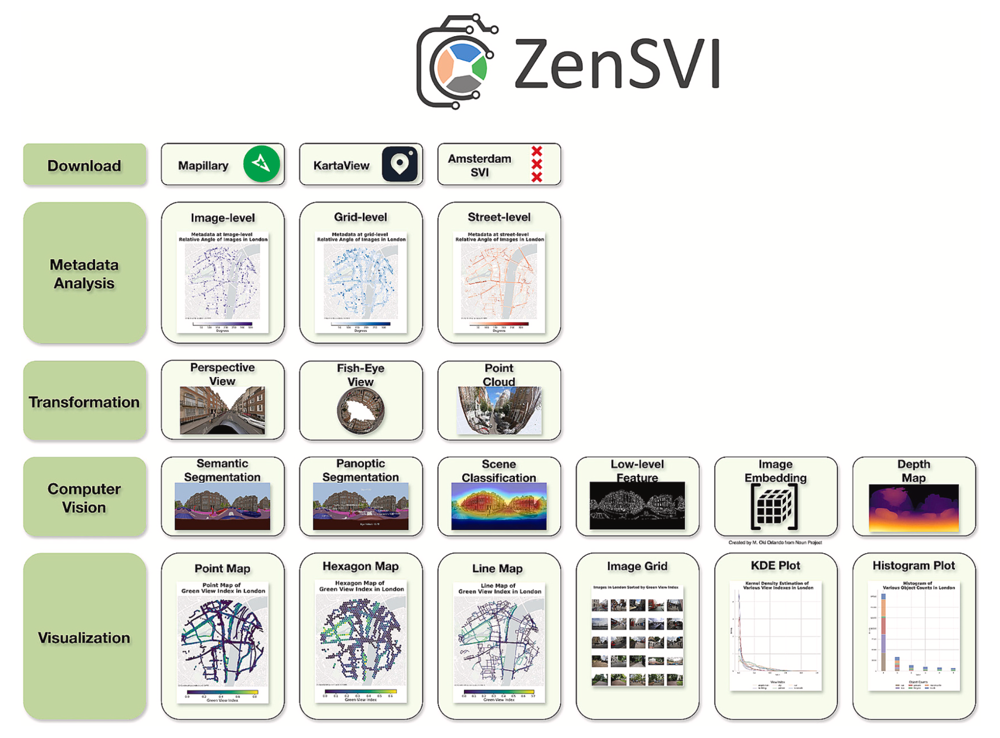
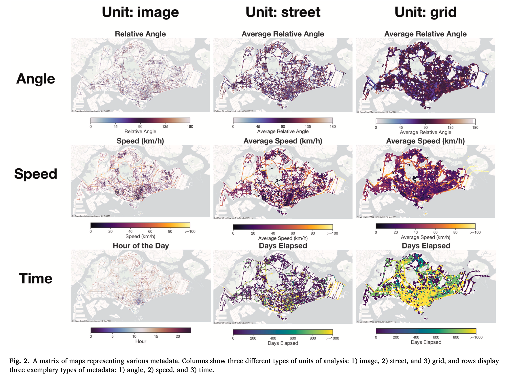
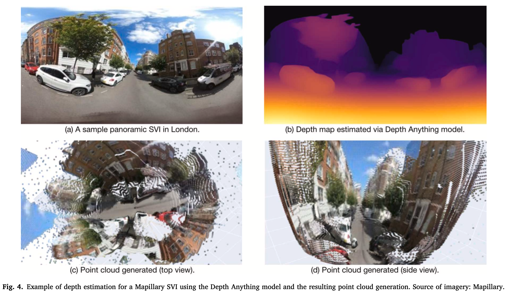
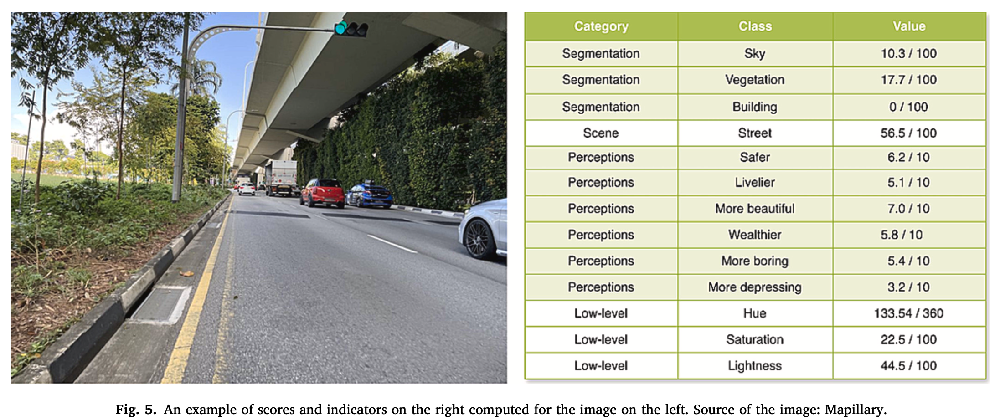
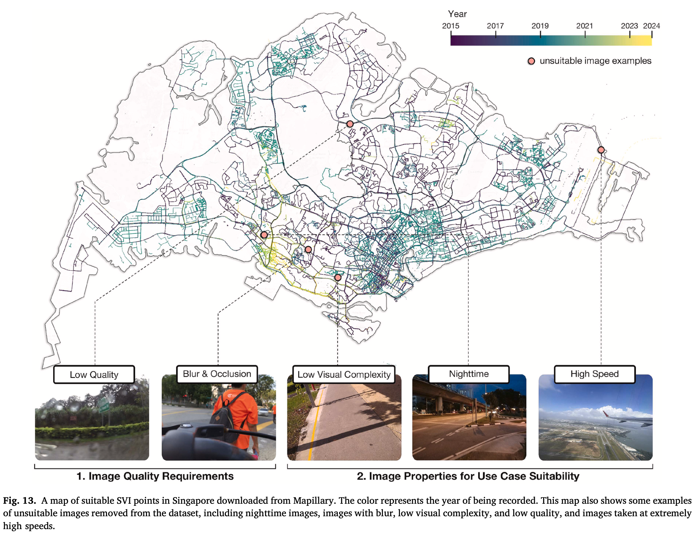
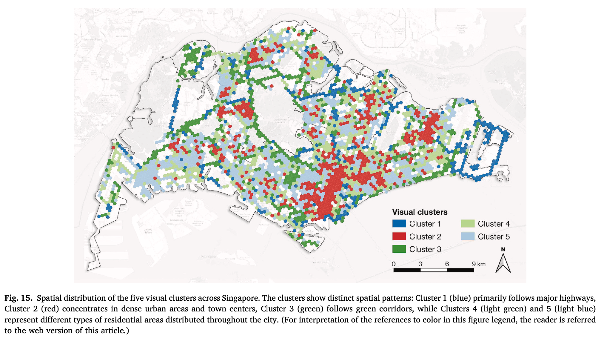
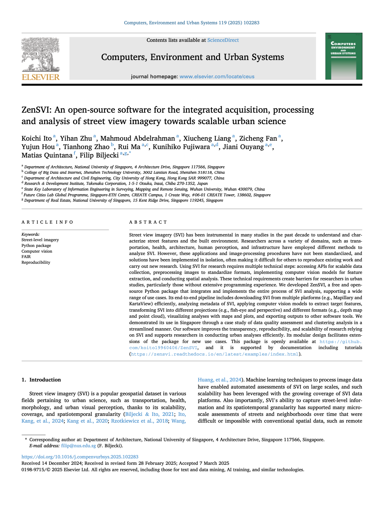

We are excited to announce our project [_ZenSVI_](https://github.com/koito19960406/ZenSVI)!

It is an open-source Python package to streamline your projects relying on Street View Imagery (SVI), from their download to analysis.
It improves the transparency, reproducibility, and scalability of such research and supports researchers in conducting urban analyses efficiently.
Its modular design facilitates extensions of the package for new use cases.
A comprehensive paper about the project is published as a namesake [article](https://doi.org/10.1016/j.compenvurbsys.2025.102283) in the _Computers, Environment and Urban Systems_:

> Ito K, Zhu Y, Abdelrahman M, Liang X, Fan Z, Hou Y, Zhao T, Ma R, Fujiwara K, Ouyang J, Quintana M, Biljecki F (2025): ZenSVI: An open-source software for the integrated acquisition, processing and analysis of street view imagery towards scalable urban science. _Computers, Environment and Urban Systems_ 119: 102283.
> [<i class="ai ai-doi-square ai"></i>10.1016/j.compenvurbsys.2025.102283](https://doi.org/10.1016/j.compenvurbsys.2025.102283) [<i class="far fa-file-pdf"></i> PDF](/publication/2025-ceus-zensvi/2025-ceus-zensvi.pdf)</i>



The project was led by {}, and it was carried out in a large collaboration within our research group.



Our software improves the transparency, reproducibility, and scalability of research relying on SVI and supports researchers in conducting urban analyses efficiently. Its modular design facilitates extensions of the package for new use cases. This package is openly available on [GitHub](https://github.com/koito19960406/ZenSVI), and it is supported by [documentation including tutorials](https://zensvi.readthedocs.io/en/latest/index.html).

The paper is [available freely](https://authors.elsevier.com/a/1kn-6jFQh4Moj) until 2025-05-09.










## Highlights

+ Streamlined the complete street view imagery analytics process in Python.
+ Integration of advanced image processing and analysis techniques.
+ Robust transformation and customization tools that can be extended by the open source community.
+ Framework to support various SVI analyses such as quality assessment, clustering, and green view index construction.
+ Lowering technical barriers and increasing equity of participation in urban studies.

## Abstract

> Street view imagery (SVI) has been instrumental in many studies in the past decade to understand and characterize street features and the built environment. Researchers across a variety of domains, such as transportation, health, architecture, human perception, and infrastructure have employed different methods to analyze SVI. However, these applications and image-processing procedures have not been standardized, and solutions have been implemented in isolation, often making it difficult for others to reproduce existing work and carry out new research. Using SVI for research requires multiple technical steps: accessing APIs for scalable data collection, preprocessing images to standardize formats, implementing computer vision models for feature extraction, and conducting spatial analysis. These technical requirements create barriers for researchers in urban studies, particularly those without extensive programming experience. We developed ZenSVI, a free and open-source Python package that integrates and implements the entire process of SVI analysis, supporting a wide range of use cases. Its end-to-end pipeline includes downloading SVI from multiple platforms (e.g., Mapillary and KartaView) efficiently, analyzing metadata of SVI, applying computer vision models to extract target features, transforming SVI into different projections (e.g., fish-eye and perspective) and different formats (e.g., depth map and point cloud), visualizing analyses with maps and plots, and exporting outputs to other software tools. We demonstrated its use in Singapore through a case study of data quality assessment and clustering analysis in a streamlined manner. Our software improves the transparency, reproducibility, and scalability of research relying on SVI and supports researchers in conducting urban analyses efficiently. Its modular design facilitates extensions of the package for new use cases. This package is openly available at https://github.com/koito19960406/ZenSVI, and it is supported by documentation including tutorials (https://zensvi.readthedocs.io/en/latest/examples/index.html).

### Paper 

For more information, please see the [paper](/publication/2025-ceus-zensvi/).

[](/publication/2025-ceus-zensvi/)

BibTeX citation:
```bibtex
@article{2025_ceus_zensvi,
  author = {Ito, Koichi and Zhu, Yihan and Abdelrahman, Mahmoud and Liang, Xiucheng and Fan, Zicheng and Hou, Yujun and Zhao, Tianhong and Ma, Rui and Fujiwara, Kunihiko and Ouyang, Jiani and Quintana, Matias and Biljecki, Filip},
  doi = {10.1016/j.compenvurbsys.2025.102283},
  journal = {Computers, Environment and Urban Systems},
  pages = {102283},
  title = {ZenSVI: An open-source software for the integrated acquisition, processing and analysis of street view imagery towards scalable urban science},
  volume = {119},
  year = {2025}
}
```


