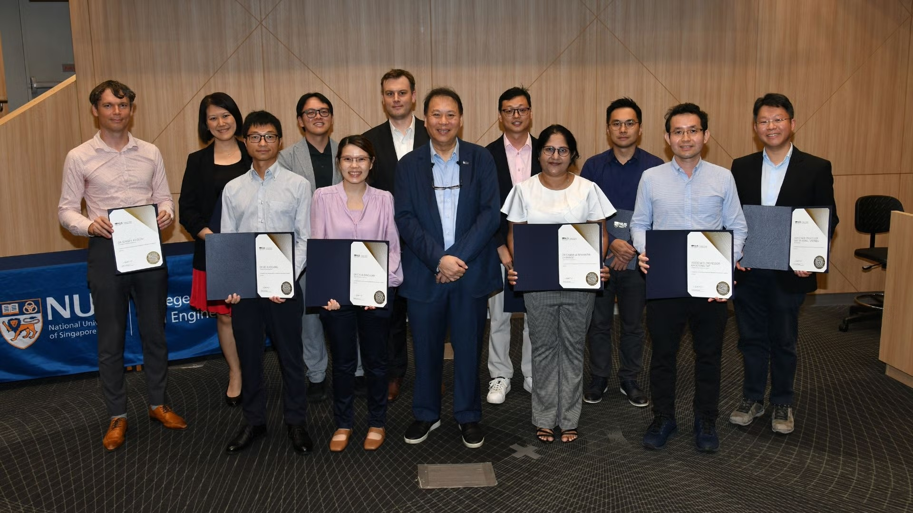

The PI of our research group, {}, has been awarded the College Educator Award AY 2023/24 from the NUS College of Design & Engineering.

This honour recognises faculty teaching excellence and dedication to student learning. A big thank you to our TAs -- {}, {}, {}, {} and {} -- for their invaluable support in our Lab's courses, which are mostly conducted in the Master of Urban Planning programme at our Department of Architecture.

Congratulations as well to all the other awardees, including colleagues from our sister labs!

Read more [here](https://cde.nus.edu.sg/news-detail/faculty-honoured-at-cde-awards-and-recognition-ceremony/).
