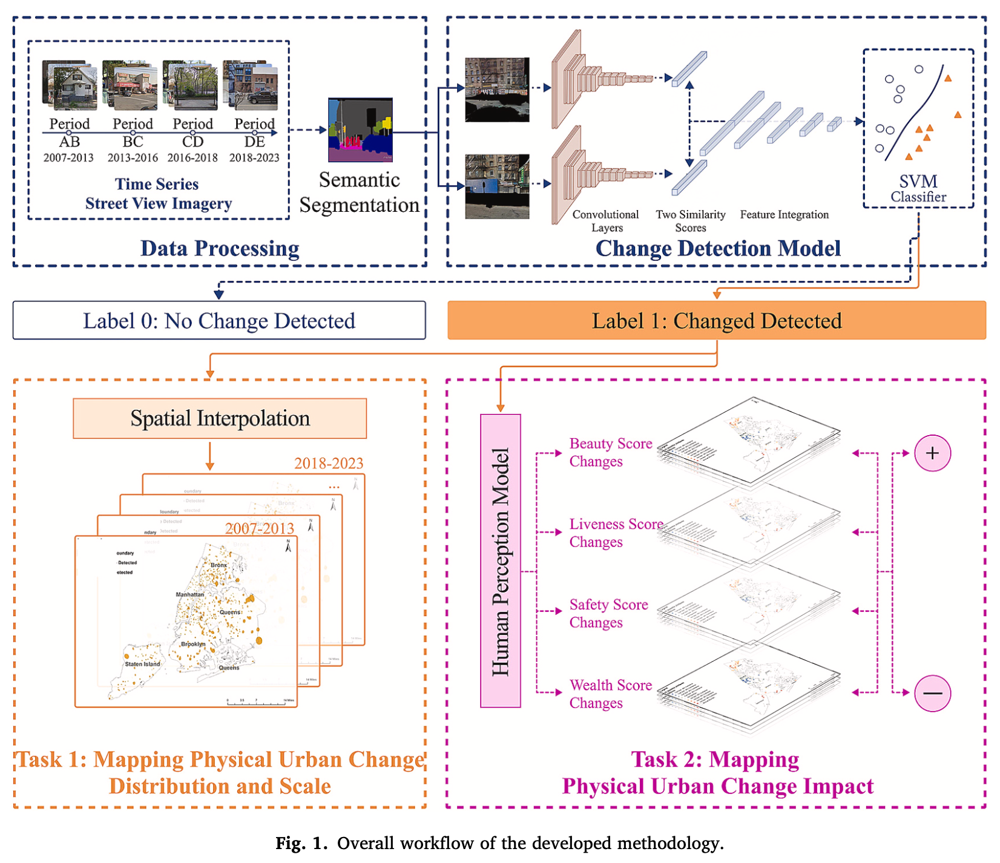
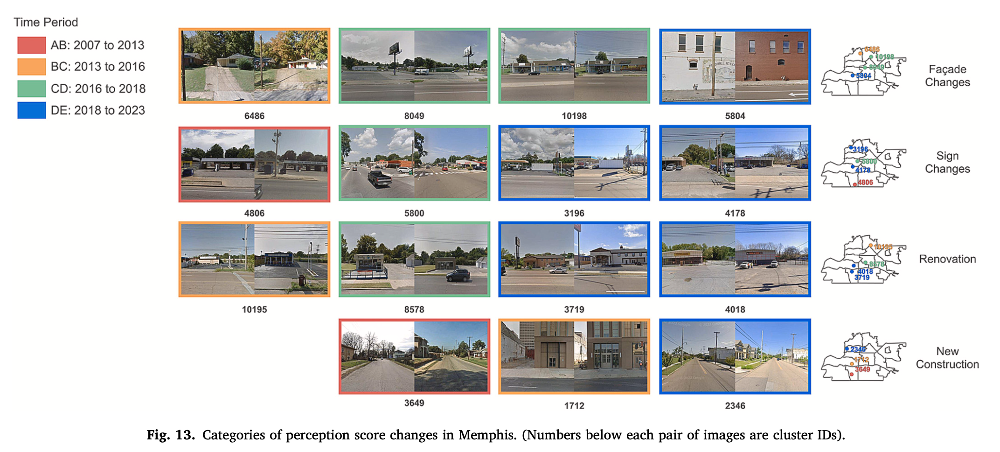
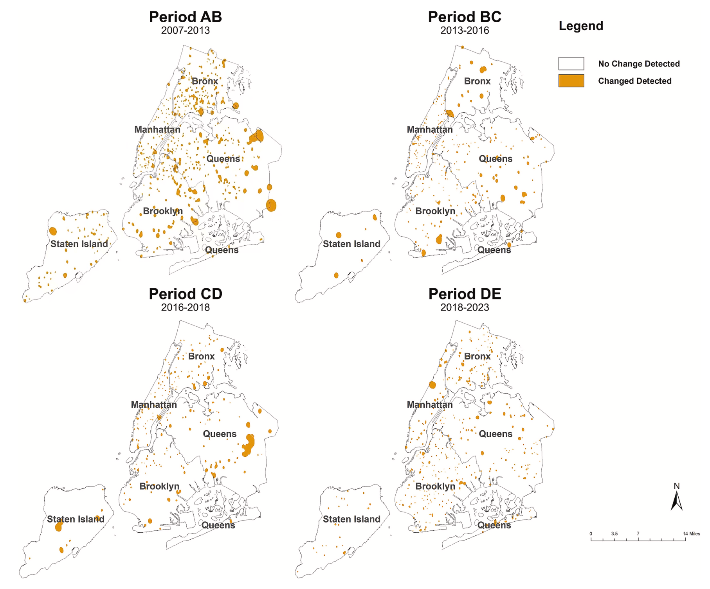
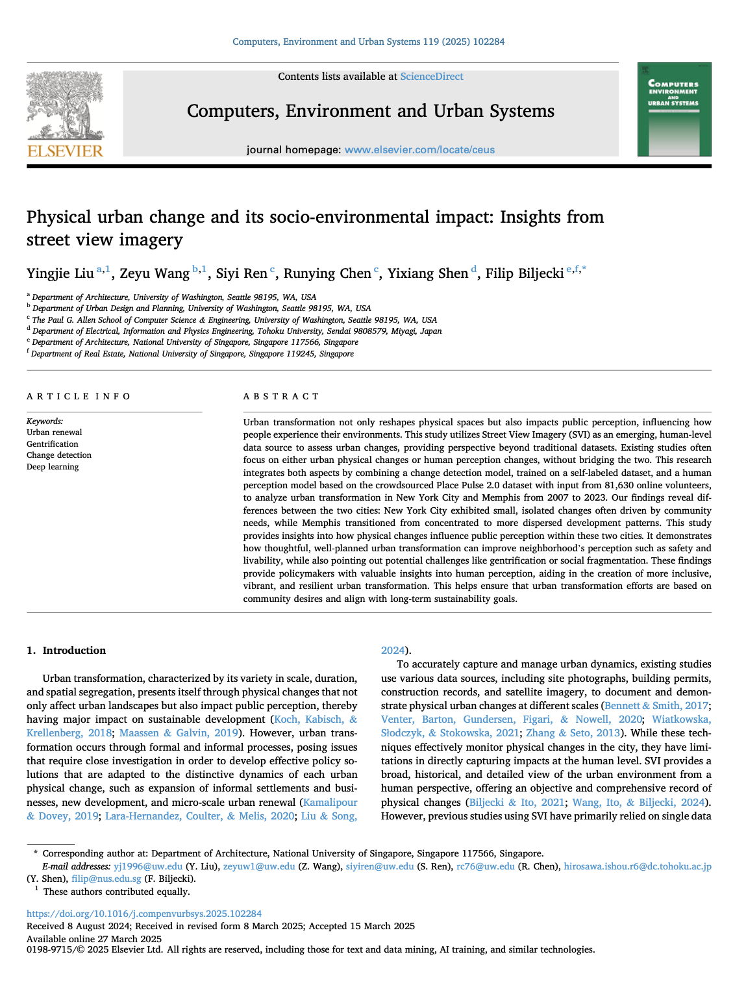

We are glad to share a new collaborative paper:

> Liu Y, Wang Z, Ren S, Chen R, Shen Y, Biljecki F (2025): Physical urban change and its socio-environmental impact: Insights from street view imagery. Computers, Environment and Urban Systems 119: 102284. [<i class="ai ai-doi-square ai"></i> 10.1016/j.compenvurbsys.2025.102284](https://doi.org/10.1016/j.compenvurbsys.2025.102284) [<i class="far fa-file-pdf"></i> PDF](/publication/2025-ceus-urbanchange/2025-ceus-urbanchange.pdf)</i>

This research was led by [Yingjie Liu](https://www.linkedin.com/in/yingjie-liu-318860211) and {} from the [College of Built Environments at the University of Washington](https://be.uw.edu/).
Congratulations on the publication! :raised_hands: :clap:

The paper is [available freely](https://authors.elsevier.com/a/1kqiOjFQh4Mov) until 2025-05-16.



## Highlights

+ Investigating formal and informal urban transformation processes and evaluating its impact to public perception.
+ Time series Street View Imagery for a detailed, human-scale view of urban physical change detection.
+ Urban change detection by combining two machine learning models.
+ Examining cities of varying sizes and characteristics to gain a comprehensive understanding of urban transformation.



### Abstract

Urban transformation not only reshapes physical spaces but also impacts public perception, influencing how people experience their environments. This study utilizes Street View Imagery (SVI) as an emerging, human-level data source to assess urban changes, providing perspective beyond traditional datasets. Existing studies often focus on either urban physical changes or human perception changes, without bridging the two. This research integrates both aspects by combining a change detection model, trained on a self-labeled dataset, and a human perception model based on the crowdsourced Place Pulse 2.0 dataset with input from 81,630 online volunteers, to analyze urban transformation in New York City and Memphis from 2007 to 2023. Our findings reveal differences between the two cities: New York City exhibited small, isolated changes often driven by community needs, while Memphis transitioned from concentrated to more dispersed development patterns. This study provides insights into how physical changes influence public perception within these two cities. It demonstrates how thoughtful, well-planned urban transformation can improve neighborhood's perception such as safety and livability, while also pointing out potential challenges like gentrification or social fragmentation. These findings provide policymakers with valuable insights into human perception, aiding in the creation of more inclusive, vibrant, and resilient urban transformation. This helps ensure that urban transformation efforts are based on community desires and align with long-term sustainability goals.



### Paper 

For more information, please see the [paper](/publication/2025-ceus-urbanchange/).

[](/publication/2025-ceus-urbanchange/)

BibTeX citation:
```bibtex
@article{2025_ceus_urbanchange,
  author = {Liu, Yingjie and Wang, Zeyu and Ren, Siyi and Chen, Runying and Shen, Yixiang and Biljecki, Filip},
  doi = {10.1016/j.compenvurbsys.2025.102284},
  journal = {Computers, Environment and Urban Systems},
  pages = {102284},
  title = {Physical urban change and its socio-environmental impact: Insights from street view imagery},
  volume = {119},
  year = {2025}
}
```
