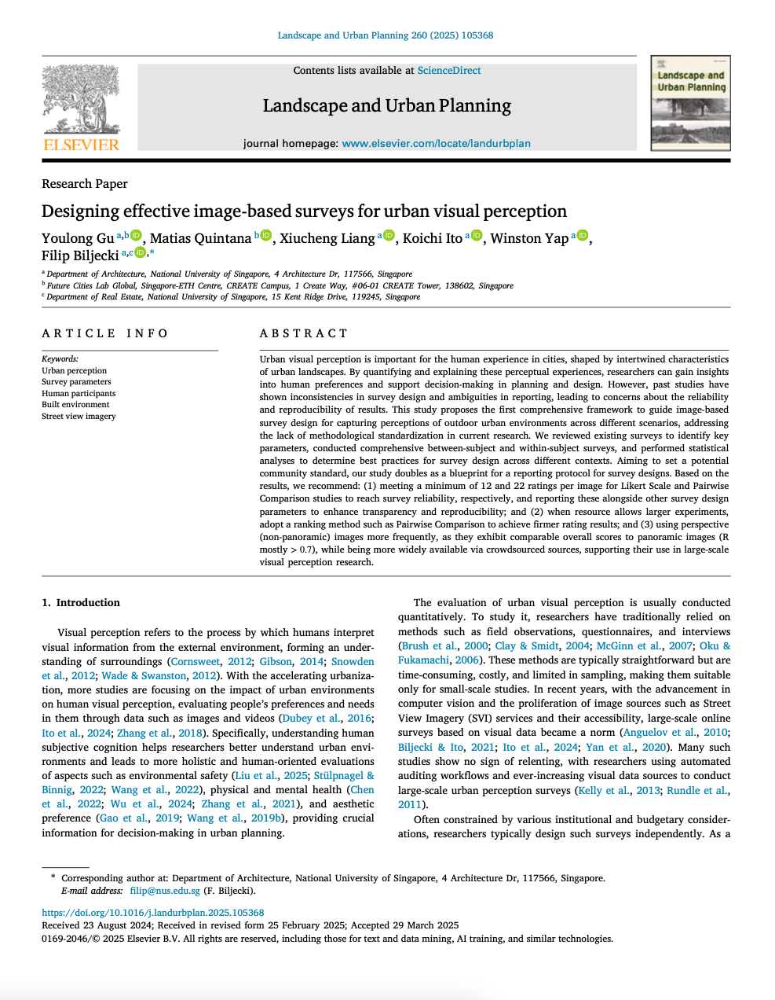

We are glad to share our new paper:

> Gu Y, Quintana M, Liang X, Ito K, Yap W, Biljecki F (2025): Designing effective image-based surveys for urban visual perception. Landscape and Urban Planning, 260: 105368. [<i class="ai ai-doi-square ai"></i> 10.1016/j.landurbplan.2025.105368](https://doi.org/10.1016/j.landurbplan.2025.105368) [<i class="far fa-file-pdf"></i> PDF](/publication/2025-land-effective-surveys/2025-land-effective-surveys.pdf)</i>

This research was led by {}.
Congratulations on his first journal publication! :raised_hands: :clap:

The paper is [available freely](https://authors.elsevier.com/a/1kxswcUG5aKal) until 2025-06-06.


### Highlights

+ Perception surveys of urban visual landscapes are crucial in planning and design.
+ They vary substantially and there is no standard ensuring validity and robustness.
+ We established survey design guidelines supported by statistics and experiments.
+ Robust results require >12 Likert ratings and >22 Pairwise Comparisons per image.
+ Reporting protocol to communicate effectively the design and parameters of surveys.


### Abstract

Urban visual perception is important for the human experience in cities, shaped by intertwined characteristics of urban landscapes. By quantifying and explaining these perceptual experiences, researchers can gain insights into human preferences and support decision-making in planning and design. However, past studies have shown inconsistencies in survey design and ambiguities in reporting, leading to concerns about the reliability and reproducibility of results. This study proposes the first comprehensive framework to guide image-based survey design for capturing perceptions of outdoor urban environments across different scenarios, addressing the lack of methodological standardization in current research. We reviewed existing surveys to identify key parameters, conducted comprehensive between-subject and within-subject surveys, and performed statistical analyses to determine best practices for survey design across different contexts. Aiming to set a potential community standard, our study doubles as a blueprint for a reporting protocol for survey designs. Based on the results, we recommend: (1) meeting a minimum of 12 and 22 ratings per image for Likert Scale and Pairwise Comparison studies to reach survey reliability, respectively, and reporting these alongside other survey design parameters to enhance transparency and reproducibility; and (2) when resource allows larger experiments, adopt a ranking method such as Pairwise Comparison to achieve firmer rating results; and (3) using perspective (non-panoramic) images more frequently, as they exhibit comparable overall scores to panoramic images (R mostly >0.7), while being more widely available via crowdsourced sources, supporting their use in large-scale visual perception research.

### Paper 

For more information, please see the [paper](/publication/2025-land-effective-surveys/).

[](/publication/2025-land-effective-surveys/)

BibTeX citation:
```bibtex
@article{2025_land_effective_surveys,
  author = {Gu, Youlong and Quintana, Matias and Liang, Xiucheng and Ito, Koichi and Yap, Winston and Biljecki, Filip},
  doi = {10.1016/j.landurbplan.2025.105368},
  journal = {Landscape and Urban Planning},
  pages = {105368},
  title = {Designing effective image-based surveys for urban visual perception},
  volume = {260},
  year = {2025}
}
```
