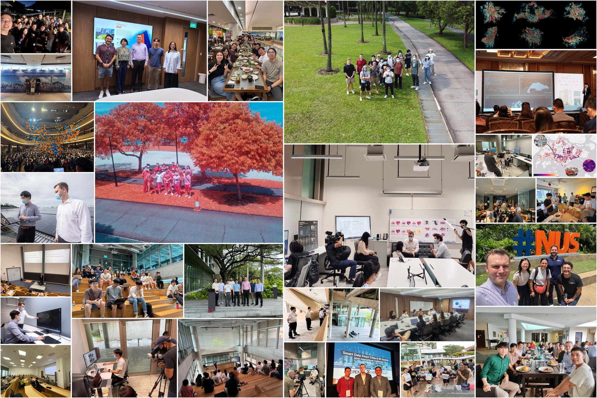

Time flies when you are surrounded by passionate and bright people.

This month it has been 6 years since our research group started 🥼🧪🌏.
What began as a small effort has grown into a vibrant & diverse research group through which 80+ researchers from 18 countries, and across several disciplines, have passed, brought together by a shared curiosity for data & cities.

While we could boast about achievements such as impactful papers and metrics, what we are most grateful for, and proud of, are the real outputs: meaningful collaborations, the career journeys we have helped shape, and the culture we have built.

A huge thank you to all lab members past and present, our collaborators within and outside NUS & SG, the wider research community for their interest in our work, and everyone who has supported us, in ways big and small, especially our funders and the Department of Architecture, College of Design & Engineering, National University of Singapore where we are proudly based. 

We will keep doing our best to advance urban data science, enhance geospatial & urban informatics capacity building at NUS and beyond, and strengthen Singapore's position in the global academic landscape of our field.

We have some new exciting research developments to share soon.
Follow our work here our website ([RSS feed](/post/index.xml)) or on [LinkedIn](https://www.linkedin.com/company/urban-analytics-lab/).
