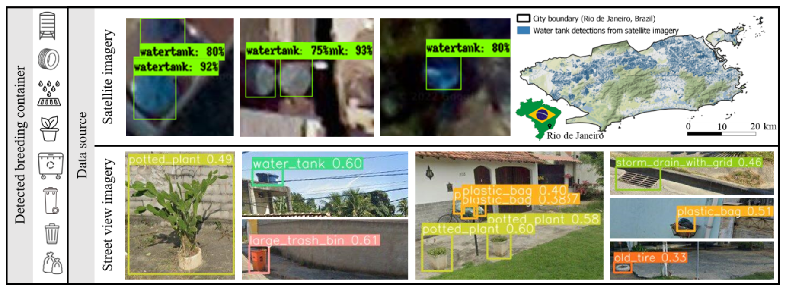
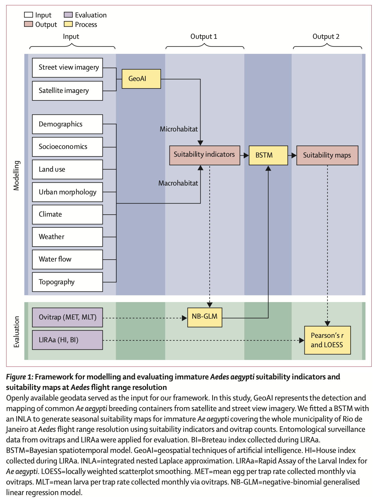
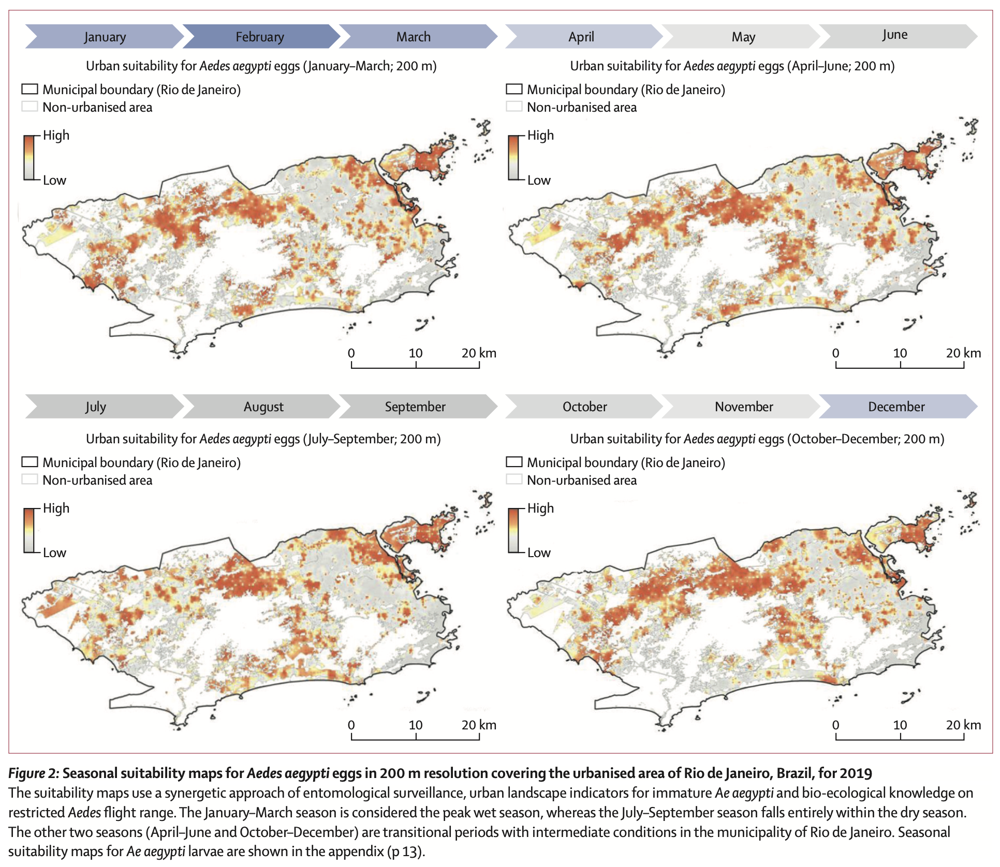
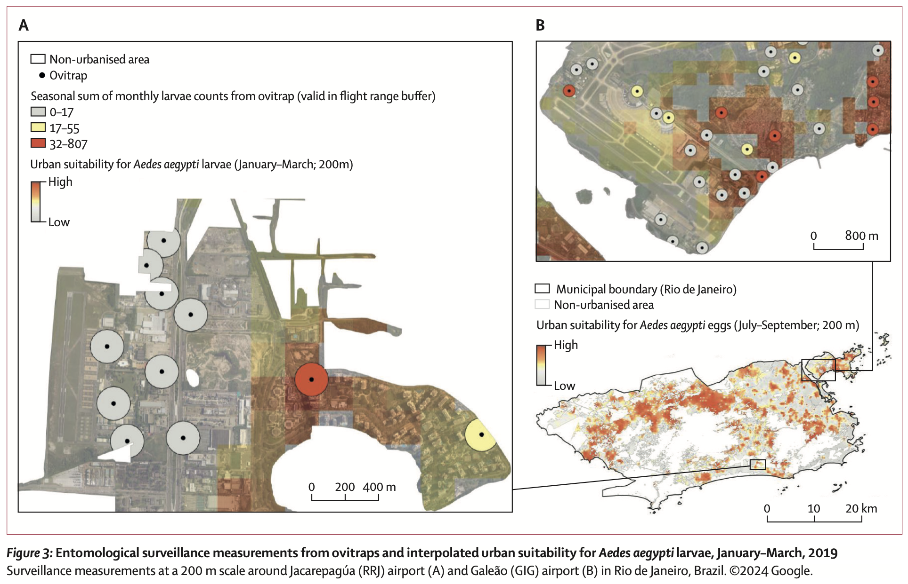
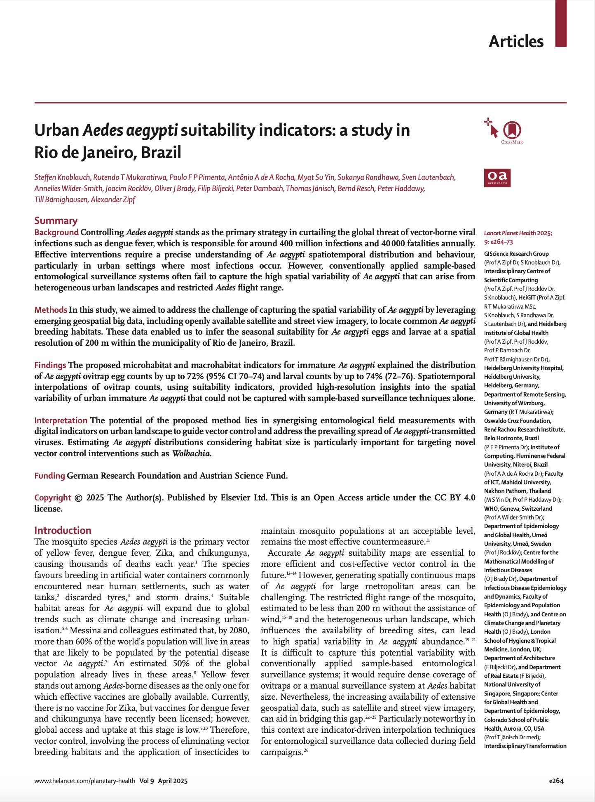

We are glad to share a new collaborative paper:

> Knoblauch S, Mukaratirwa RT, Pimenta Paulo FP, de A Rocha A, Su YM, Randhawa S, Lautenbach S, Wilder-Smith A, Rocklöv J, Brady OJ, Biljecki F, Dambach P, Jänisch T, Resch B, Haddawy P, Bärnighausen T, Zipf A (2025): Urban Aedes aegypti suitability indicators: a study in Rio de Janeiro, Brazil. The Lancet Planetary Health 9(4): e264-e273. [<i class="ai ai-doi-square ai"></i> 10.1016/S2542-5196(25)00049-X](https://doi.org/10.1016/S2542-5196(25)00049-X) [<i class="far fa-file-pdf"></i> PDF](/publication/2025-tlph-aedes/2025-tlph-aedes.pdf)</i> <i class="ai ai-open-access-square ai"></i>

This research was led by [Steffen Knoblauch](https://www.geog.uni-heidelberg.de/gis/knoblauch.html) from the [GIScience Research Group](https://www.geog.uni-heidelberg.de/gis/index_en.html) at Heidelberg University in Germany.
Congratulations on the publication! :raised_hands: :clap:

The paper is [available open access](https://doi.org/10.1016/S2542-5196(25)00049-X).







### Summary

#### Background

Controlling Aedes aegypti stands as the primary strategy in curtailing the global threat of vector-borne viral infections such as dengue fever, which is responsible for around 400 million infections and 40 000 fatalities annually. Effective interventions require a precise understanding of Ae aegypti spatiotemporal distribution and behaviour, particularly in urban settings where most infections occur. However, conventionally applied sample-based entomological surveillance systems often fail to capture the high spatial variability of Ae aegypti that can arise from heterogeneous urban landscapes and restricted Aedes flight range.

#### Methods

In this study, we aimed to address the challenge of capturing the spatial variability of Ae aegypti by leveraging emerging geospatial big data, including openly available satellite and street view imagery, to locate common Ae aegypti breeding habitats. These data enabled us to infer the seasonal suitability for Ae aegypti eggs and larvae at a spatial resolution of 200 m within the municipality of Rio de Janeiro, Brazil.

#### Findings

The proposed microhabitat and macrohabitat indicators for immature Ae aegypti explained the distribution of Ae aegypti ovitrap egg counts by up to 72% (95% CI 70–74) and larval counts by up to 74% (72–76). Spatiotemporal interpolations of ovitrap counts, using suitability indicators, provided high-resolution insights into the spatial variability of urban immature Ae aegypti that could not be captured with sample-based surveillance techniques alone.

#### Interpretation

The potential of the proposed method lies in synergising entomological field measurements with digital indicators on urban landscape to guide vector control and address the prevailing spread of Ae aegypti-transmitted viruses. Estimating Ae aegypti distributions considering habitat size is particularly important for targeting novel vector control interventions such as Wolbachia.

#### Funding

German Research Foundation and Austrian Science Fund.



### Paper 

For more information, please see the [paper](/publication/2025-tlph-aedes/) (open access <i class="ai ai-open-access-square ai"></i>).

[](/publication/2025-tlph-aedes/)

BibTeX citation:
```bibtex
@article{2025_tlph_aedes,
  author = {Knoblauch, Steffen and Mukaratirwa, Rutendo T and Pimenta, Paulo F P and de A Rocha, Ant{\^o}nio A and Yin, Myat Su and Randhawa, Sukanya and Lautenbach, Sven and Wilder-Smith, Annelies and Rockl{\"o}v, Joacim and Brady, Oliver J and Biljecki, Filip and Dambach, Peter and J{\"a}nisch, Thomas and Resch, Bernd and Haddawy, Peter and B{\"a}rnighausen, Till and Zipf, Alexander},
  doi = {10.1016/s2542-5196(25)00049-x},
  journal = {The Lancet Planetary Health},
  month = apr,
  number = {4},
  pages = {e264--e273},
  title = {Urban Aedes aegypti suitability indicators: a study in Rio de Janeiro, Brazil},
  volume = {9},
  year = {2025}
}
```
