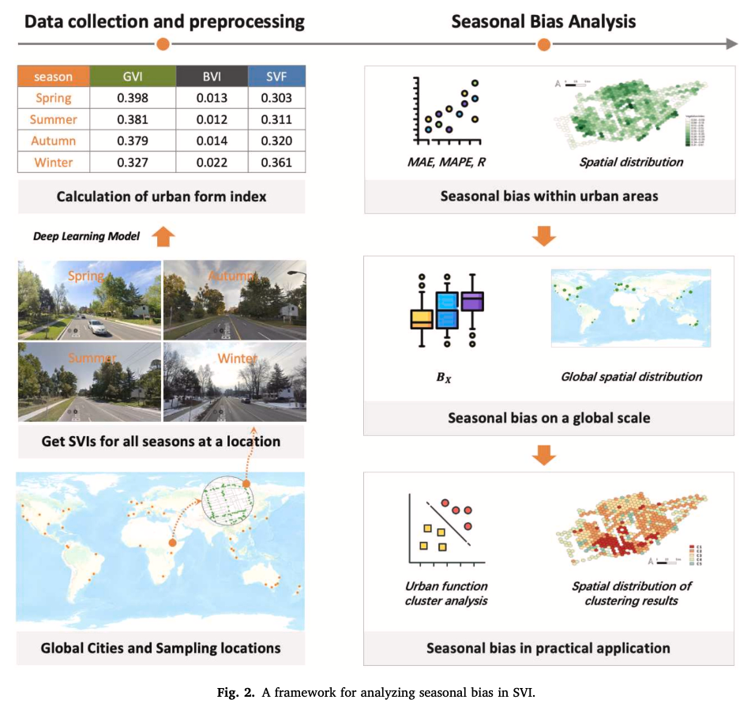

We are glad to share a new collaborative paper:

> Zhao T, Liang X, Biljecki F, Tu W, Cao J, Li X, Yi S (2025): Quantifying seasonal bias in street view imagery for urban form assessment: A global analysis of 40 cities. Computers, Environment and Urban Systems 120: 102302. [<i class="ai ai-doi-square ai"></i> 10.1016/j.compenvurbsys.2025.102302](https://doi.org/10.1016/j.compenvurbsys.2025.102302) [<i class="far fa-file-pdf"></i> PDF](/publication/2025-ceus-svi-seasonality/2025-ceus-svi-seasonality.pdf)</i> <i class="ai ai-open-access-square ai"></i>

This research was led by {}.
Congratulations on the publication! :raised_hands: :clap:

The paper is [available open access](https://doi.org/10.1016/j.compenvurbsys.2025.102302).



### Highlights

+ First framework for quantifying seasonal bias in street view imagery.
+ Evaluates seasonal bias across 40 global cities.
+ Identifies significant seasonal bias in high-latitude, low-rainfall cities.
+ Examines uncertainty in urban form indices derived from street view data.


### Abstract

Street view imagery (SVI), with its rich visual information, is increasingly recognized as a valuable data source for urban research. Particularly, by leveraging computer vision techniques, SVI can be used to calculate various urban form indices (e.g., Green View Index, GVI), providing a new approach for large-scale quantitative assessments of urban environments. However, SVI data collected at the same location in different seasons can yield varying urban form indices due to phenological changes, even when the urban form remains constant. Numerous studies overlook this kind of seasonal bias. To address this gap, we propose a systematic analytical framework for quantifying and evaluating seasonal bias in SVI, drawing on more than 262,000 images from 40 cities worldwide. This framework encompasses three aspects: seasonal bias within urban areas, seasonal bias across cities on a global scale, and the impact of seasonal bias in practical applications. The results reveal that (1) seasonal bias is evident, with an average mean absolute percentage error (MAPE) of 54 % for GVI across all sampled cities, and it is particularly pronounced in areas with significant seasonal bias; (2) seasonal bias is strongly correlated with geographic location, with greater bias observed in cities with lower average rainfall and temperatures; and (3) in practical applications, ignoring seasonal bias may result in analytical errors (e.g., an ARI of 0.35 in clustering). By identifying and quantifying seasonal bias in SVI, this study contributes to improving the accuracy of urban environmental assessments based on street view data and provides new theoretical support for the broader application of such data on a global scale.

### Paper 

For more information, please see the [paper](/publication/2025-ceus-svi-seasonality/) (open access <i class="ai ai-open-access-square ai"></i>).

[](/publication/2025-ceus-svi-seasonality/)

BibTeX citation:
```bibtex
@article{2025_ceus_svi_seasonality,
  author = {Zhao, Tianhong and Liang, Xiucheng and Biljecki, Filip and Tu, Wei and Cao, Jinzhou and Li, Xiaojiang and Yi, Shengao},
  doi = {10.1016/j.compenvurbsys.2025.102302},
  journal = {Computers, Environment and Urban Systems},
  pages = {102302},
  title = {Quantifying seasonal bias in street view imagery for urban form assessment: A global analysis of 40 cities},
  volume = {120},
  year = {2025}
}
```
