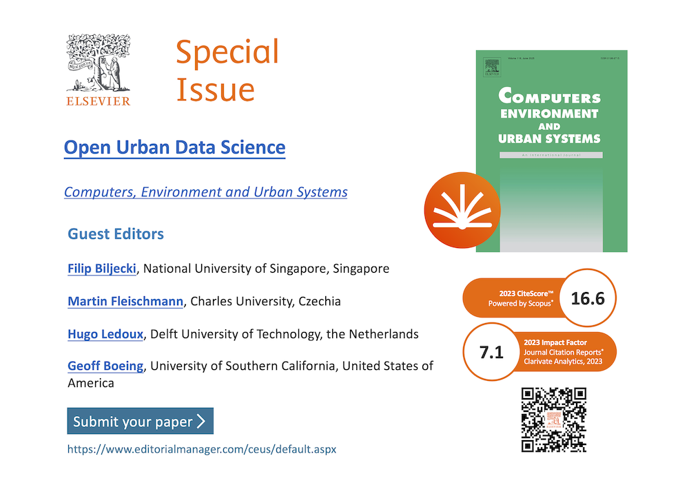

We are organising a unique special issue in [CEUS](https://www.sciencedirect.com/journal/computers-environment-and-urban-systems).
The [Call for Papers](https://www.sciencedirect.com/special-issue/322127/open-urban-data-science) is copied below.

---

## Open Urban Data Science

Submission deadline: 31 May 2026

### Guest editors:

+ Filip Biljecki, National University of Singapore, Singapore

+ Martin Fleischmann, Charles University, Czechia

+ Hugo Ledoux, Delft University of Technology, the Netherlands

+ Geoff Boeing, University of Southern California, United States of America

### Special issue information:

Computers, Environment and Urban Systems (CEUS) invites submissions for a special issue dedicated to Open Urban Data Science, with a particular focus on open software tools that enable innovative computer-based research on urban systems, systems of cities, and built and natural environments, emphasising the geospatial perspective. This special issue aims to recognise and promote the scholarly contributions represented by research software development at the urban scale.

We welcome contributions addressing, but not limited to:

+ Novel software tools for urban data collection, processing, visualisation, or analysis.
+ Comprehensive platforms and frameworks that integrate multiple urban data sources.
+ Methods for addressing privacy, equity, and ethics in urban data.
+ Computational frameworks for urban simulation and modelling.
+ Software for analysing urban mobility, morphology, accessibility, and transportation, and other domains relevant to the journal.
+ Citizen science platforms for urban data collection and engagement.

Manuscripts should present original software tools, packages, or frameworks developed for urban data science applications. Submissions are expected to be comprehensive, including a literature review, information on software architecture, implementation details, availability, and elaborate examples demonstrating utility for research.

In addition to software papers, regular types of articles that are related to open urban data science are also welcome provided they demonstrate a strong connection to the theme of the special issue.

### Evaluation criteria:

Submissions will be evaluated based on their relevance and alignment with the journal's scope, quality (e.g. robustness and reliability of the software), usability (e.g. comprehensive documentation, ease of use, and accessibility), significance (e.g. potential impact on research and practice), innovation (e.g. novelty of the software or methodological approach), and sustainability (e.g. maintenance, support, and adoption). The usual expectations from an academic article (e.g. including a state of the art literature review and articulation of scholarly contributions) apply.

All submissions must adhere to open science principles. The software must be released under an appropriate open-source license, be permanently available, and be free of restrictions on use.

For questions regarding this special issue, please contact the editors.

For examples of relevant papers, please see the following past publications in CEUS and related journals.

+ Boeing, G. (2017). OSMnx: New methods for acquiring, constructing, analyzing, and visualizing complex street networks. Computers, Environment and Urban Systems, 65, 126–139. https://doi.org/10.1016/j.compenvurbsys.2017.05.004
+ Biljecki, F., & Chow, Y. S. (2022). Global Building Morphology Indicators. Computers, Environment and Urban Systems, 95, 101809. https://doi.org/10.1016/j.compenvurbsys.2022.101809
+ Danish, M., Labib, S., Ricker, B., & Helbich, M. (2024). A citizen science toolkit to collect human perceptions of urban environments using open street view images. Computers, Environment and Urban Systems, 116, 102207. https://doi.org/10.1016/j.compenvurbsys.2024.102207
+ Félix, R., Moura, F., & Lovelace, R. (2024). Reproducible methods for modeling combined public transport and cycling trips and associated benefits: Evidence from the biclaR tool. Computers, Environment and Urban Systems, 117, 102230. https://doi.org/10.1016/j.compenvurbsys.2024.102230
+ Ito et al. (2025). ZenSVI: An open-source software for the integrated acquisition, processing and analysis of street view imagery towards scalable urban science. Computers, Environment and Urban Systems, 119: 102283. https://doi.org/10.1016/j.compenvurbsys.2025.102283
+ Mahajan, S. (2024). greenR: An open-source framework for quantifying urban greenness. Ecological Indicators, 163, 112108. https://doi.org/10.1016/j.ecolind.2024.112108
+ Sevtsuk, A., & Alhassan, A. (2025). Madina Python package: Scalable urban network analysis for modeling pedestrian and bicycle trips in cities. Journal of Transport Geography, 123, 104130. https://doi.org/10.1016/j.jtrangeo.2025.104130

### Timeline:

Submissions are accepted until 31 May 2026.

Articles will be published on a rolling basis immediately after acceptance and production. The special issue containing an editorial will be released after all submissions are processed, sometime in 2027.

Software papers do not need to be anonymised and shall contain links to public repositories.

The journal’s submission platform ([Editorial Manager](https://www.editorialmanager.com/ceus/default.aspx)) is now available for receiving submissions to this Special Issue. Please select the article type of “VSI: Open Urban Data Science” when submitting your manuscript online. The submission portal could be found on the Journal Homepage [here](https://www.sciencedirect.com/journal/computers-environment-and-urban-systems).

[Check out the FAQs on special issues](https://www.elsevier.com/researcher/author/submit-your-paper/special-issues/special-issue-invitation-faqs).

[Learn more about the benefits of publishing in a special issue](https://www.elsevier.com/authors/submit-your-paper/special-issues).

