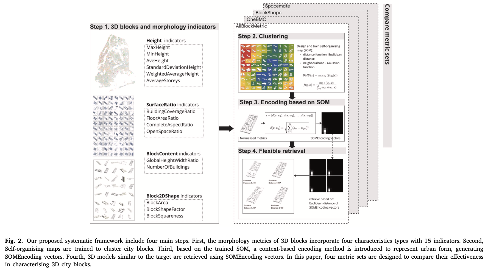
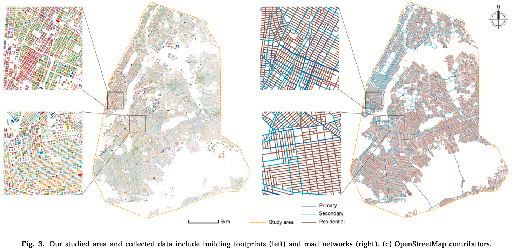
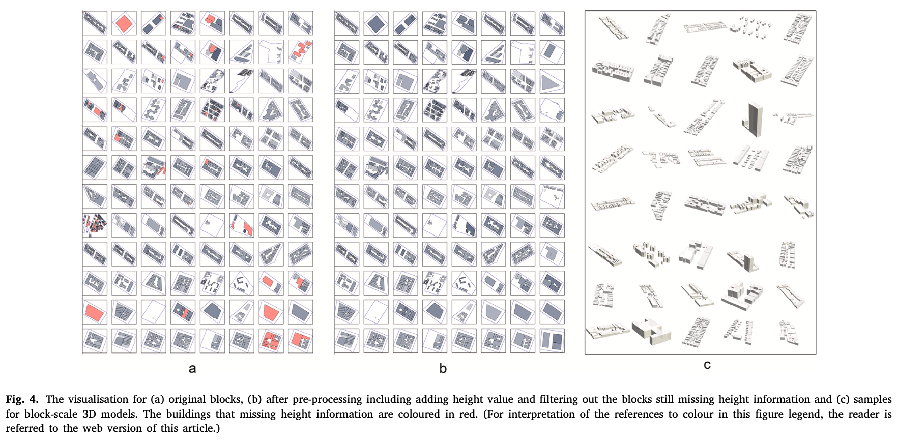
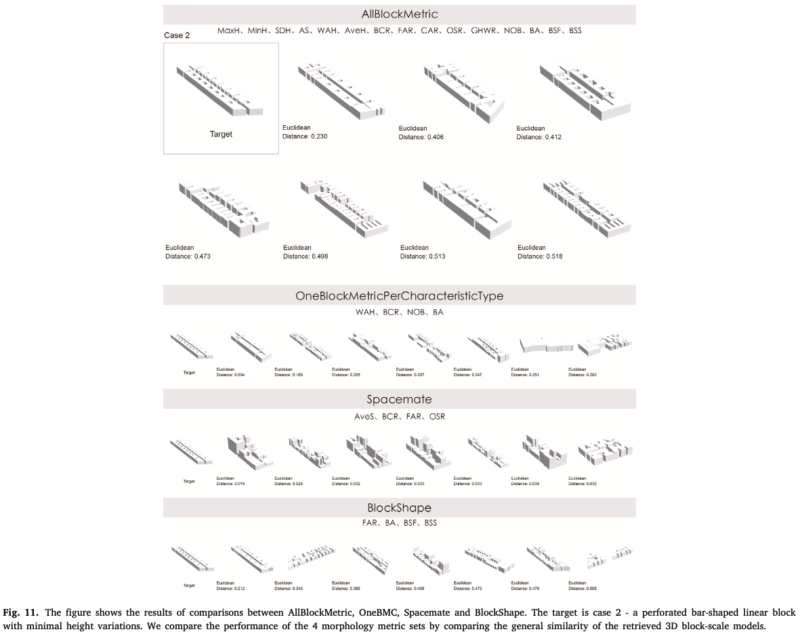
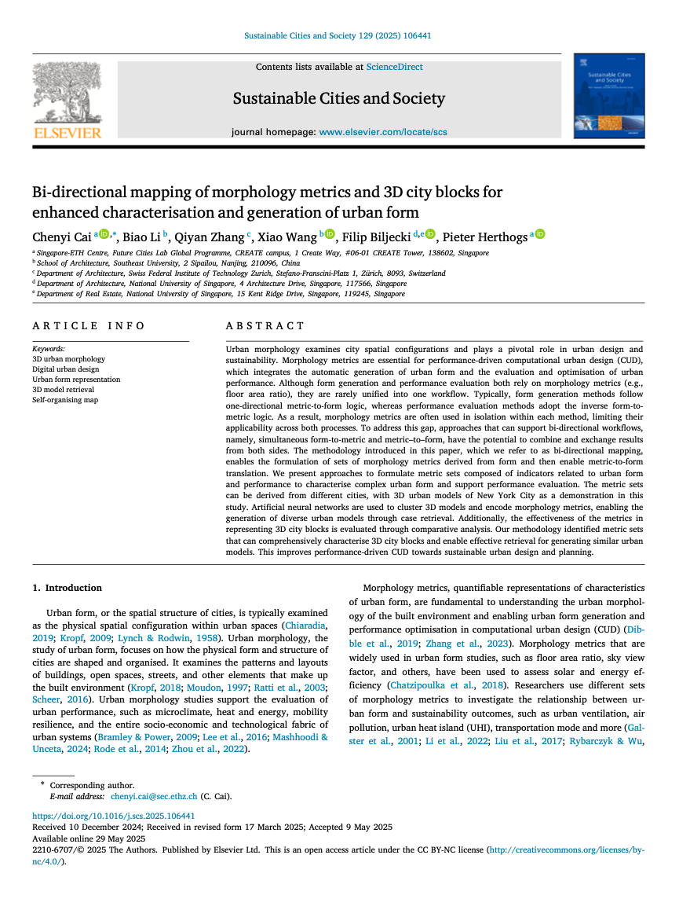

We are glad to share a new collaborative paper:

> Cai C, Li B, Zhang Q, Wang X, Biljecki F, Herthogs P (2025): Bi-directional mapping of morphology metrics and 3D city blocks for enhanced characterisation and generation of urban form. Sustainable Cities and Society 129: 106441. [<i class="ai ai-doi-square ai"></i> 10.1016/j.scs.2025.106441](https://doi.org/10.1016/j.scs.2025.106441) [<i class="far fa-file-pdf"></i> PDF](/publication/2025-scs-bidirectional/2025-scs-bidirectional.pdf)</i> <i class="ai ai-open-access-square ai"></i>

This research was led by {}.
Congratulations on the publication! :raised_hands: :clap:

The paper is [available open access](https://doi.org/10.1016/j.scs.2025.106441).



### Highlights

+ Enhanced morphology metrics are proposed to characterise block-scale 3D urban form.
+ The introduced metric set integrates UMIs for buildings and performance evaluation.
+ Systematic workflows retrieve diverse 3D block models using metrics.
+ A novel bi-directional mapping between urban form and morphology metrics is built.
+ This study advances performance-driven urban form generation and optimisation in CUD.







### Abstract

Urban morphology examines city spatial configurations and plays a pivotal role in urban design and sustainability. Morphology metrics are essential for performance-driven computational urban design (CUD), which integrates the automatic generation of urban form and the evaluation and optimisation of urban performance. Although form generation and performance evaluation both rely on morphology metrics (e.g., floor area ratio), they are rarely unified into one workflow. Typically, form generation methods follow one-directional metric-to-form logic, whereas performance evaluation methods adopt the inverse form-to-metric logic. As a result, morphology metrics are often used in isolation within each method, limiting their applicability across both processes. To address this gap, approaches that can support bi-directional workflows, namely, simultaneous form-to-metric and metric–to–form, have the potential to combine and exchange results from both sides. The methodology introduced in this paper, which we refer to as bi-directional mapping, enables the formulation of sets of morphology metrics derived from form and then enable metric-to-form translation. We present approaches to formulate metric sets composed of indicators related to urban form and performance to characterise complex urban form and support performance evaluation. The metric sets can be derived from different cities, with 3D urban models of New York City as a demonstration in this study. Artificial neural networks are used to cluster 3D models and encode morphology metrics, enabling the generation of diverse urban models through case retrieval. Additionally, the effectiveness of the metrics in representing 3D city blocks is evaluated through comparative analysis. Our methodology identified metric sets that can comprehensively characterise 3D city blocks and enable effective retrieval for generating similar urban models. This improves performance-driven CUD towards sustainable urban design and planning.

### Paper 

For more information, please see the [paper](/publication/2025-scs-bidirectional/) (open access <i class="ai ai-open-access-square ai"></i>).

[](/publication/2025-scs-bidirectional/)

BibTeX citation:
```bibtex
@article{2025_scs_bidirectional,
  author = {Cai, Chenyi and Li, Biao and Zhang, Qiyan and Wang, Xiao and Biljecki, Filip and Herthogs, Pieter},
  doi = {10.1016/j.scs.2025.106441},
  journal = {Sustainable Cities and Society},
  pages = {106441},
  title = {Bi-directional mapping of morphology metrics and 3D city blocks for enhanced characterisation and generation of urban form},
  volume = {129},
  year = {2025}
}
```
