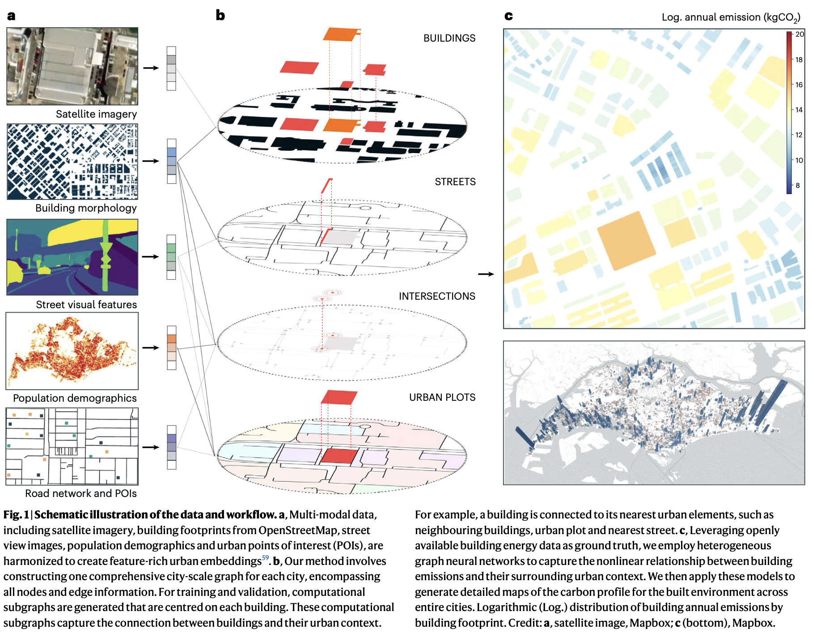
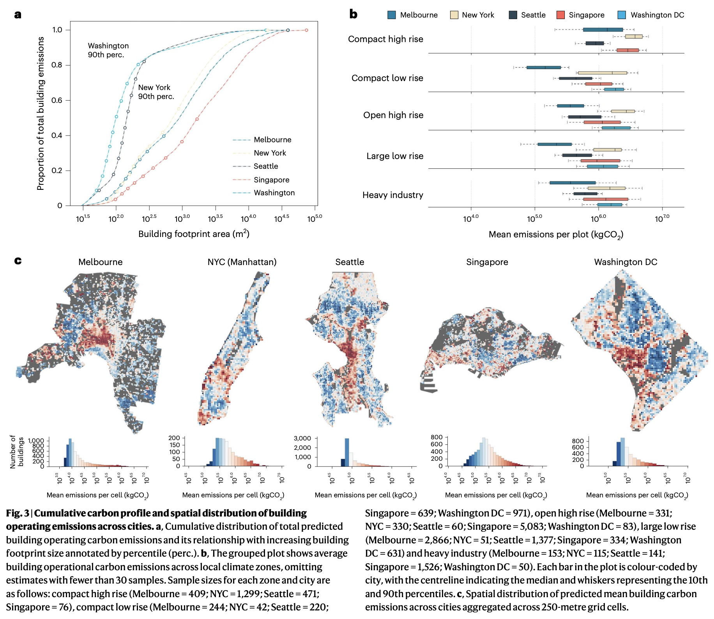
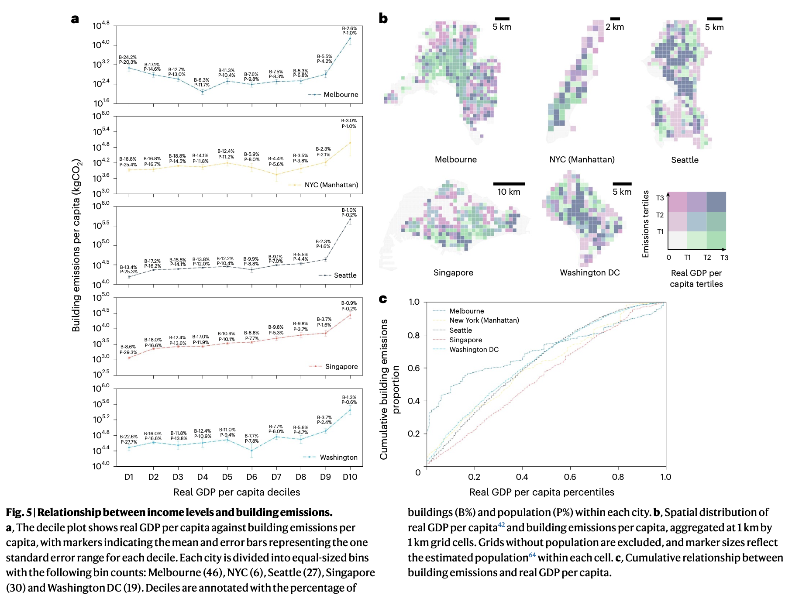
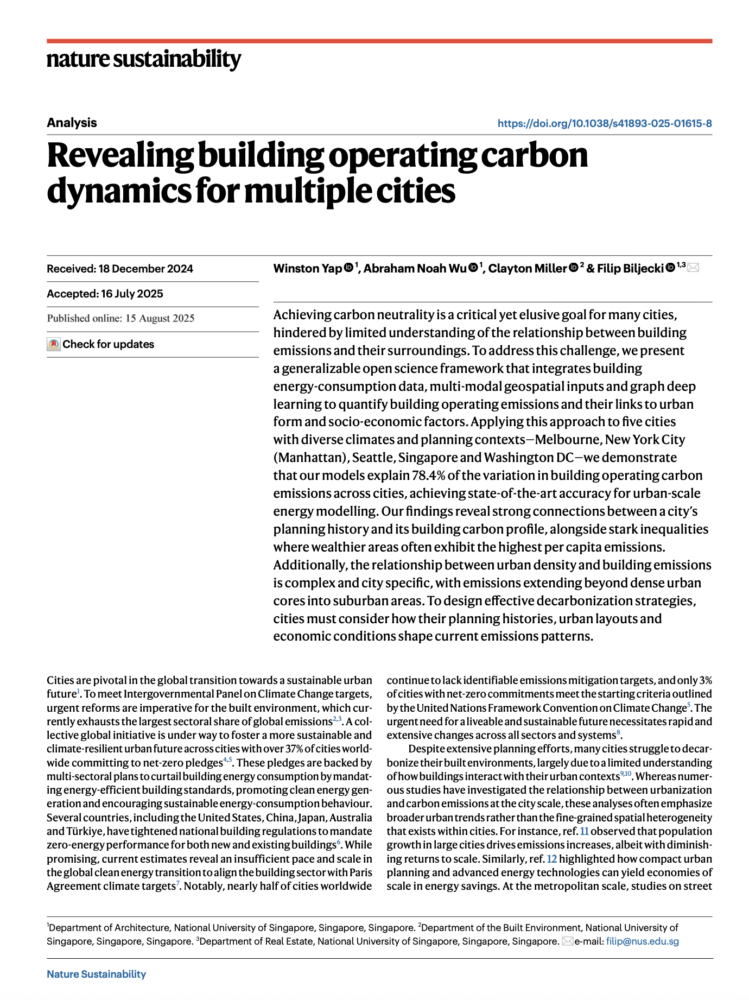

We are glad to share our new paper:

> Yap W, Wu AN, Miller C, Biljecki F (2025): Revealing building operating carbon dynamics for multiple cities. Nature Sustainability 8(10): 1199-1210. [<i class="ai ai-doi-square ai"></i> 10.1038/s41893-025-01615-8](https://doi.org/10.1038/s41893-025-01615-8) [<i class="far fa-file-pdf"></i> PDF](/publication/2025-natsus-revealing/2025-natsus-revealing.pdf)</i>

This research was led by {}.
Congratulations on this important journal publication! :raised_hands: :clap:

The paper was also [featured](https://cde.nus.edu.sg/news-detail/ai-model-maps-building-emissions-to-support-fairer-climate-policies/) by our NUS College of Design and Engineering in [a video](https://www.youtube.com/watch?v=rushehhq_iI):










### Abstract

Achieving carbon neutrality is a critical yet elusive goal for many cities, hindered by limited understanding of the relationship between building emissions and their surroundings. To address this challenge, we present a generalizable open science framework that integrates building energy-consumption data, multi-modal geospatial inputs and graph deep learning to quantify building operating emissions and their links to urban form and socio-economic factors. Applying this approach to five cities with diverse climates and planning contexts—Melbourne, New York City (Manhattan), Seattle, Singapore and Washington DC—we demonstrate that our models explain 78.4% of the variation in building operating carbon emissions across cities, achieving state-of-the-art accuracy for urban-scale energy modelling. Our findings reveal strong connections between a city’s planning history and its building carbon profile, alongside stark inequalities where wealthier areas often exhibit the highest per capita emissions. Additionally, the relationship between urban density and building emissions is complex and city specific, with emissions extending beyond dense urban cores into suburban areas. To design effective decarbonization strategies, cities must consider how their planning histories, urban layouts and economic conditions shape current emissions patterns.

### Paper 

For more information, please see the [paper](/publication/2025-natsus-revealing/).

[](/publication/2025-natsus-revealing/)

BibTeX citation:
```bibtex
@article{2025_natsus_revealing,
  author = {Yap, Winston and Wu, Abraham Noah and Miller, Clayton and Biljecki, Filip},
  doi = {10.1038/s41893-025-01615-8},
  journal = {Nature Sustainability},
  title = {Revealing building operating carbon dynamics for multiple cities},
  pages = {1199-1210},
  volume = {8},
  number = {10},
  year = {2025}
}
```
