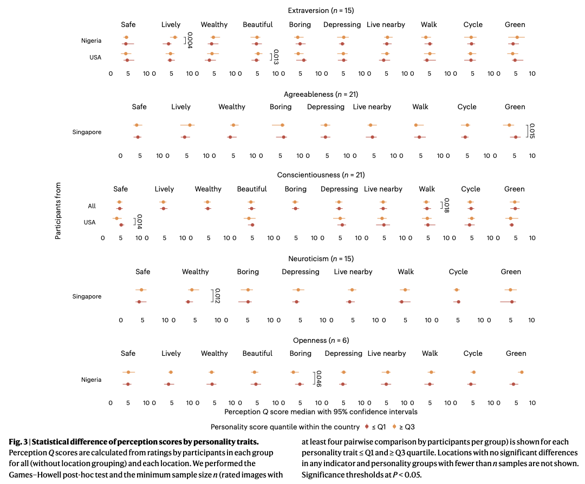
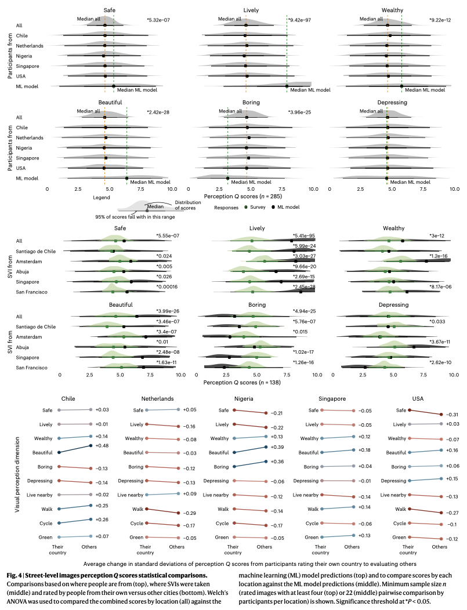
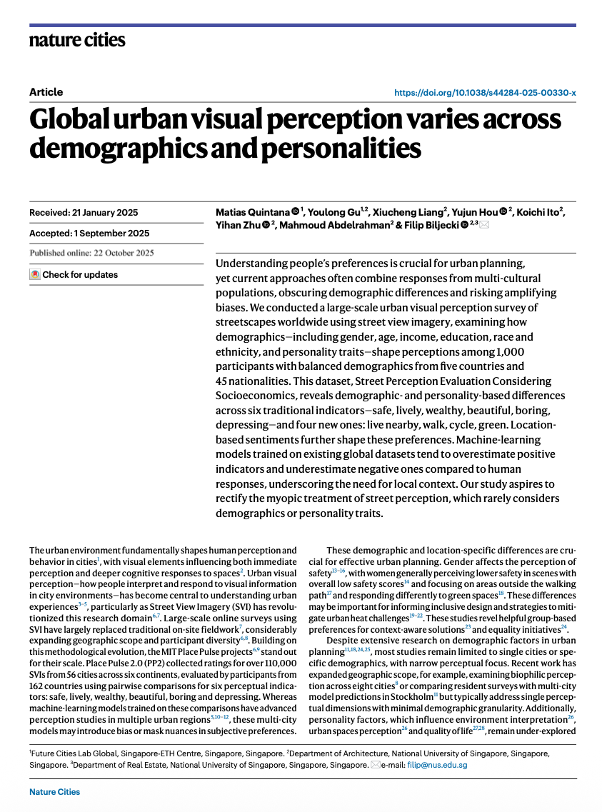

We are glad to introduce our latest open project: SPECS, which was also published as a paper.
SPECS is a big dataset on visual perception that we have collected to understand how demographics and personality drive the visual perception of streetscapes.

> Quintana M, Gu Y, Liang X, Hou Y, Ito K, Zhu Y, Abdelrahman M, Biljecki F (2025): Global urban visual perception varies across demographics and personalities. Nature Cities. [<i class="ai ai-doi-square ai"></i> 10.1038/s44284-025-00330-x](https://doi.org/10.1038/s44284-025-00330-x) [<i class="far fa-file-pdf"></i> PDF](/publication/2025-natcities-specs/2025-natcities-specs.pdf)</i>

This research was led by {}.
Congratulations on the publication! :raised_hands: :clap:

The study included surveying 1000 people from around the world (Chile, the Netherlands, Nigeria, Singapore, and the USA).
We examined how demographics (gender, age, income, education, race and ethnicity, and, for the first time, personality traits) shape perceptions among these one thousand participants with balanced demographics.
The paper asserts the importance of multi-city and multi-population analysis and it is packed with findings, e.g. that safety perceptions, in specific locations, are explained by gender.
We also showed the need for more tuned models rather than one-size-fits-all models by comparing state-of-the-art perception predictions against our dataset.

We are happy to release this global and, participants-wise, demographically balanced urban visual perception dataset openly.
The Github repository is available [here](https://github.com/matqr/specs), while the dataset can be downloaded from [here](https://huggingface.co/datasets/matiasqr/specs).







### Abstract

Understanding people’s preferences is crucial for urban planning, yet current approaches often combine responses from multi-cultural populations, obscuring demographic differences and risking amplifying biases. We conducted a large-scale urban visual perception survey of streetscapes worldwide using street view imagery, examining how demographics—including gender, age, income, education, race and ethnicity, and personality traits—shape perceptions among 1,000 participants with balanced demographics from five countries and 45 nationalities. This dataset, Street Perception Evaluation Considering Socioeconomics, reveals demographic- and personality-based differences across six traditional indicators—safe, lively, wealthy, beautiful, boring, depressing—and four new ones: live nearby, walk, cycle, green. Location-based sentiments further shape these preferences. Machine-learning models trained on existing global datasets tend to overestimate positive indicators and underestimate negative ones compared to human responses, underscoring the need for local context. Our study aspires to rectify the myopic treatment of street perception, which rarely considers demographics or personality traits.


### Paper 

For more information, please see the [paper](/publication/2025-natcities-specs/).

[](/publication/2025-natcities-specs/)

BibTeX citation:
```bibtex
@article{2025_natcities_specs,
  author = {Quintana, Matias and Gu, Youlong and Liang, Xiucheng and Hou, Yujun and Ito, Koichi and Zhu, Yihan and Abdelrahman, Mahmoud and Biljecki, Filip},
  doi = {10.1038/s44284-025-00330-x},
  journal = {Nature Cities},
  title = {Global urban visual perception varies across demographics and personalities},
  year = {2025}
}
```
