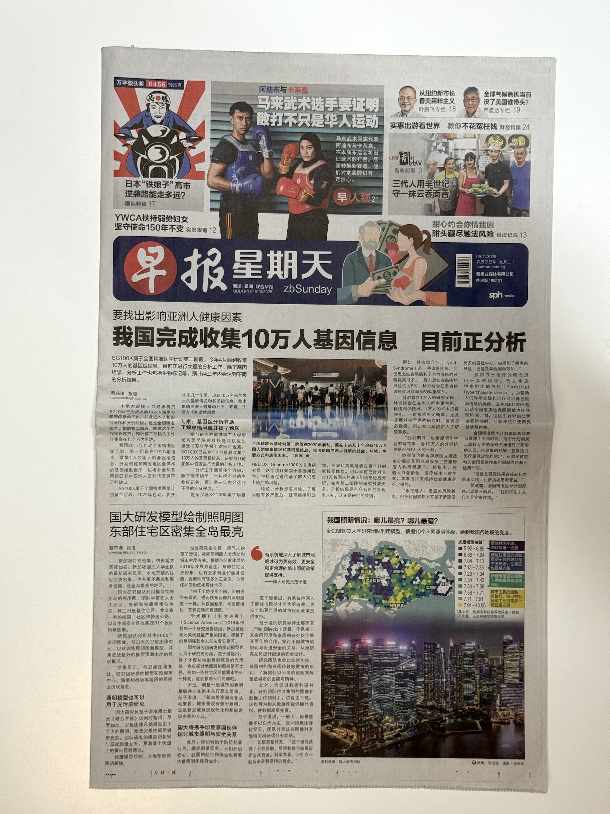
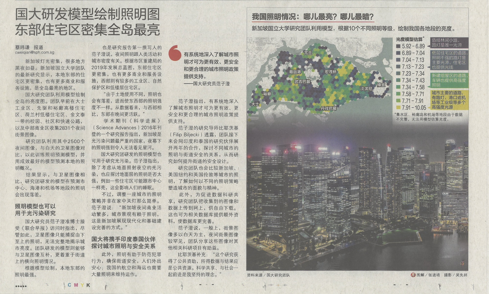

Research by {} and {} on nighttime street view imagery got featured on the front page of [Lianhe Zaobao](https://www.zaobao.com.sg), the largest Singaporean Chinese-language newspaper!

Using a new approach, the study has mapped Singapore's night-time brightness, revealing contrasts among the city-state's regions. The study found that eastern residential areas, which are denser and more active, are brighter than the western zones, which are home to more industrial estates and nature reserves. We appreciate that our work has been put in the spotlight.

Link to the online article (in Chinese) is [here](https://www.zaobao.com.sg/news/singapore/story20251109-7716374).
> 国大模型绘制新加坡“光地图” 东部夜间最亮西部较暗
> (English: The National University of Singapore (NUS) model depicts a "light map" of Singapore, showing the east being the brightest at night and the west being darker).

For more information, please see the [paper](/publication/2024-scs-night-svi/) published in Sustainable Cities and Society.

