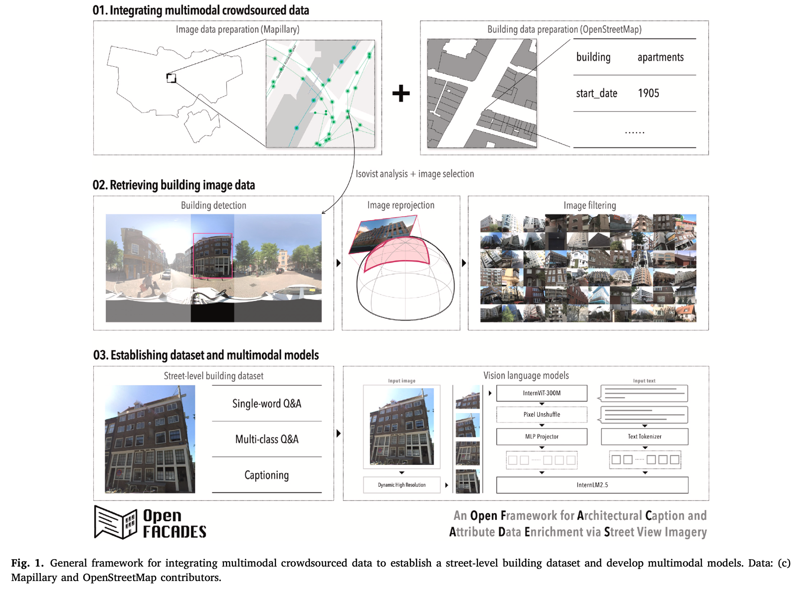
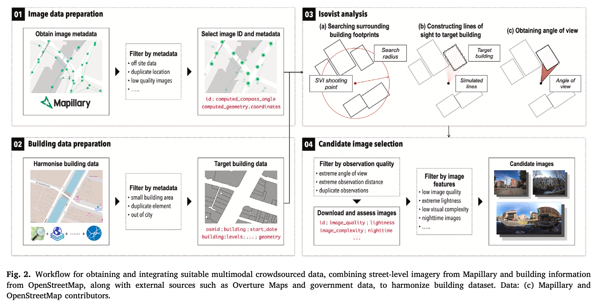
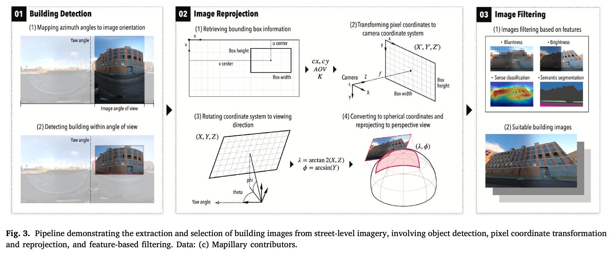
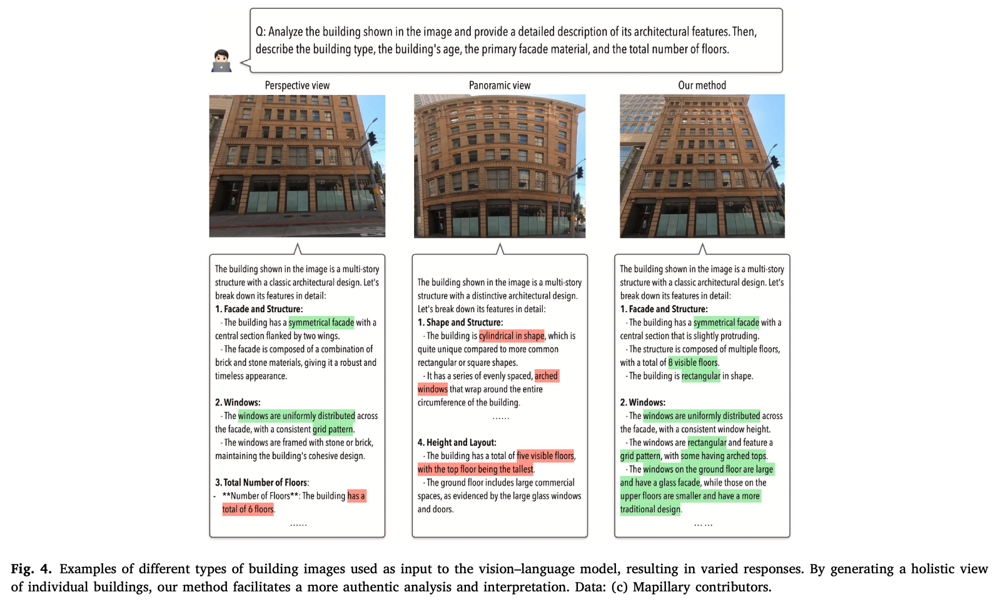
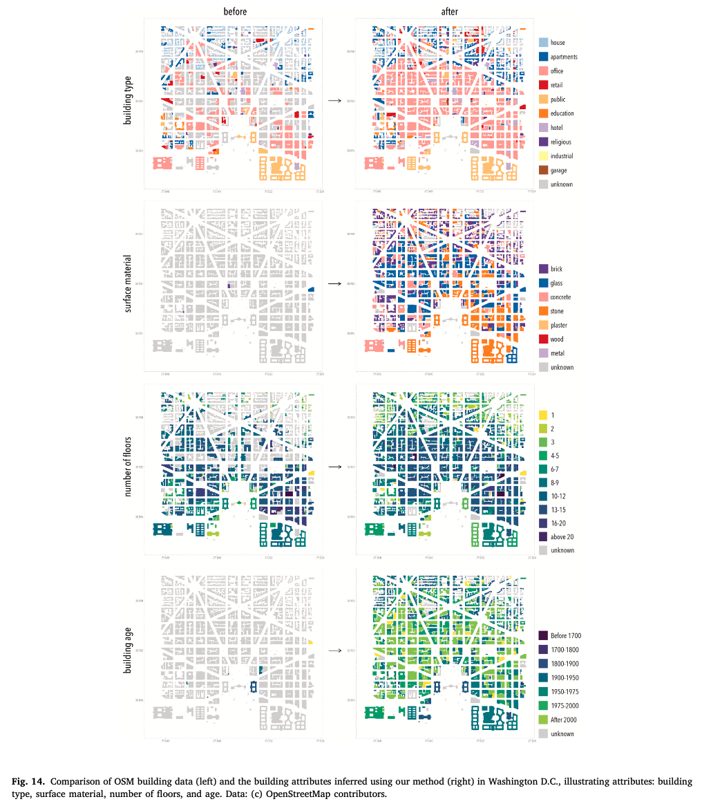
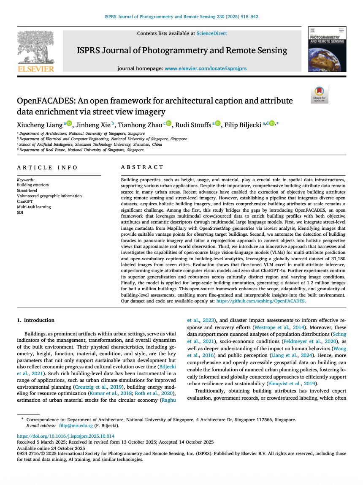

We are glad to introduce our latest open project: OpenFACADES, which was also published as a paper:

> Liang X, Xie J, Zhao T, Stouffs R, Biljecki F (2025): OpenFACADES: An open framework for architectural caption and attribute data enrichment via street view imagery. ISPRS Journal of Photogrammetry and Remote Sensing 230: 918-942. [<i class="ai ai-doi-square ai"></i> 10.1016/j.isprsjprs.2025.10.014](https://doi.org/10.1016/j.isprsjprs.2025.10.014) [<i class="far fa-file-pdf"></i> PDF](/publication/2025-ijprs-openfacades/2025-ijprs-openfacades.pdf)</i>

This research was led by {}.
Congratulations on the publication! :raised_hands: :clap:

OpenFACADES is an open-source framework designed to enrich building profiles with objective attributes and semantic descriptors by leveraging multimodal crowdsourced data and large vision-language models. It provides tools for integrating diverse datasets, automating building facade detection, and generating detailed annotations at scale.

The Github repository is available [here](https://github.com/seshing/OpenFACADES).





### Highlights

+ Method for acquiring and geolocating holistic building facades.
+ Free and open-source pipeline integrating multimodal crowdsourced data.
+ Baseline VLMs enable multi-task building facade profiling.
+ In-depth discussion of VLMs’ domain-specific robustness and adaptability.
+ Half a million buildings from 7 global cities labeled with attributes and captions.








### Abstract

Building properties, such as height, usage, and material, play a crucial role in spatial data infrastructures, supporting various urban applications. Despite their importance, comprehensive building attribute data remain scarce in many urban areas. Recent advances have enabled the extraction of objective building attributes using remote sensing and street-level imagery. However, establishing a pipeline that integrates diverse open datasets, acquires holistic building imagery, and infers comprehensive building attributes at scale remains a significant challenge. Among the first, this study bridges the gaps by introducing OpenFACADES, an open framework that leverages multimodal crowdsourced data to enrich building profiles with both objective attributes and semantic descriptors through multimodal large language models. First, we integrate street-level image metadata from Mapillary with OpenStreetMap geometries via isovist analysis, identifying images that provide suitable vantage points for observing target buildings.  Second, we automate the detection of building facades in panoramic imagery and tailor a reprojection approach to convert objects into holistic perspective views that approximate real-world observation. Third, we introduce an innovative approach that harnesses and investigates the capabilities of open-source large vision-language models (VLMs) for multi-attribute prediction and open-vocabulary captioning in building-level analytics, leveraging a globally sourced dataset of 31,180 labeled images from seven cities. Evaluation shows that fine-tuned VLM excel in multi-attribute inference, outperforming single-attribute computer vision models and zero-shot ChatGPT-4o. Further experiments confirm its superior generalization and robustness across culturally distinct region and varying image conditions. Finally, the model is applied for large-scale building annotation, generating a dataset of 1.2 million images for half a million buildings. This open‐source framework enhances the scope, adaptability, and granularity of building‐level assessments, enabling more fine‐grained and interpretable insights into the built environment. Our dataset and code are available openly at: https://github.com/seshing/OpenFACADES.


### Paper 

For more information, please see the [paper](/publication/2025-ijprs-openfacades/).

[](/publication/2025-ijprs-openfacades/)

BibTeX citation:
```bibtex
@article{2025_ijprs_openfacades,
  author = {Liang, Xiucheng and Xie, Jinheng and Zhao, Tianhong and Stouffs, Rudi and Biljecki, Filip},
  doi = {10.1016/j.isprsjprs.2025.10.014},
  journal = {ISPRS Journal of Photogrammetry and Remote Sensing},
  pages = {918--942},
  title = {OpenFACADES: An open framework for architectural caption and attribute data enrichment via street view imagery},
  volume = {230},
  year = {2025}
}
```
