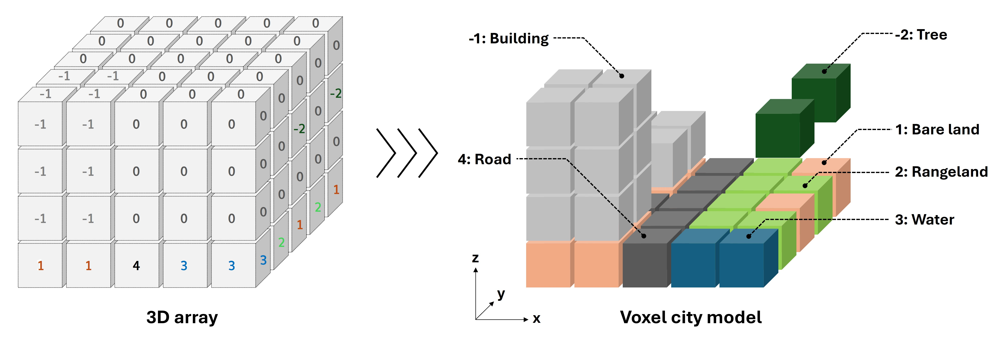
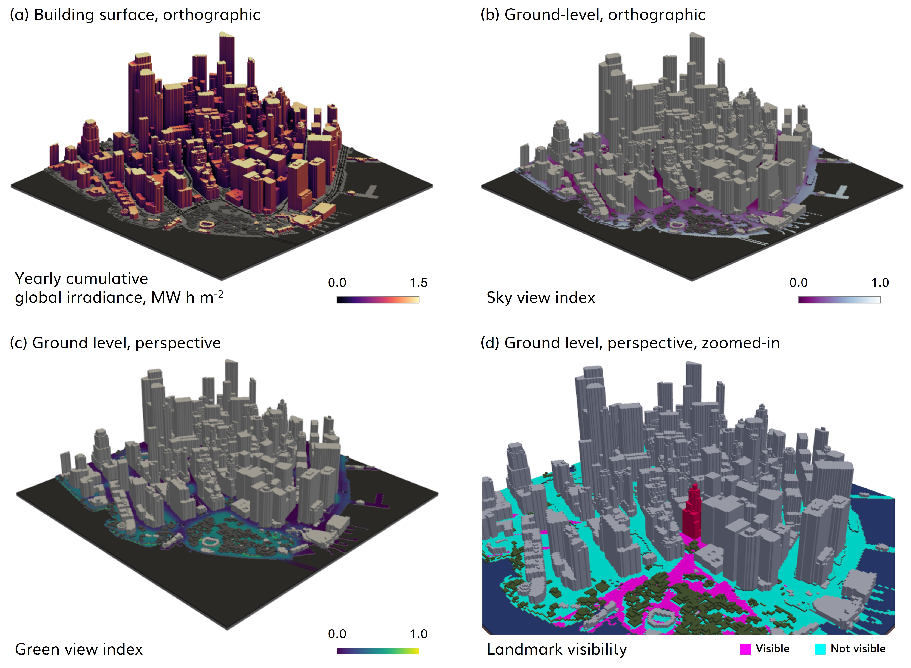
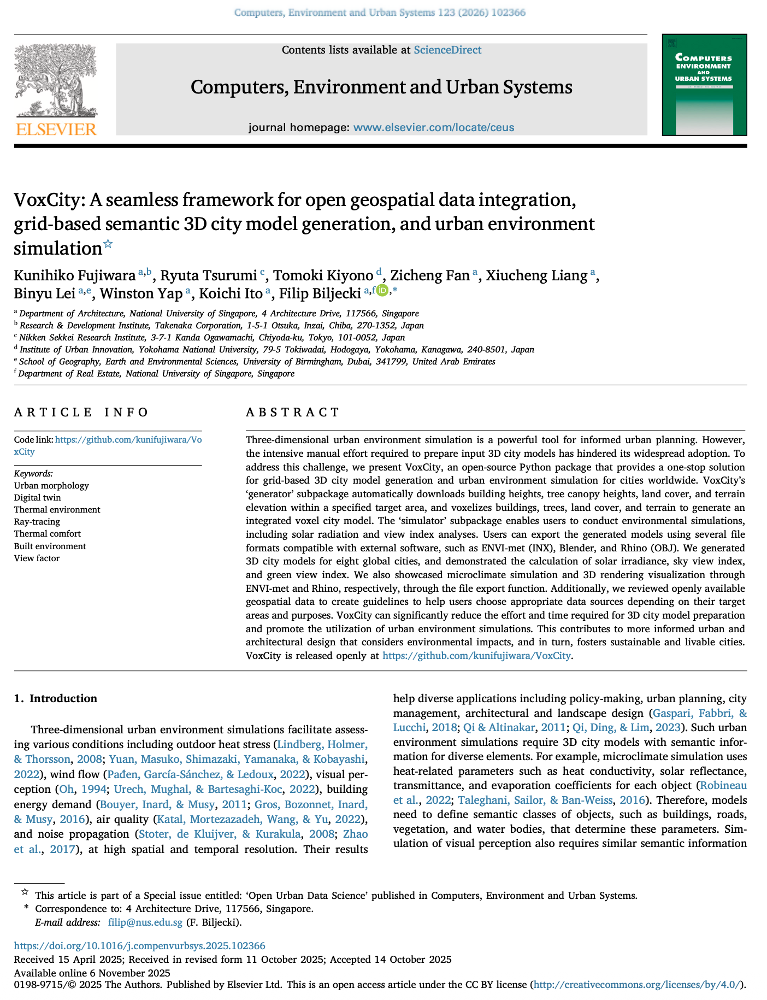

We are glad to introduce our latest open project: VoxCity, which was also published as a paper:

> Fujiwara K, Tsurumi R, Kiyono T, Fan Z, Liang X, Lei B, Yap W, Ito K, Biljecki F (2026): VoxCity: A seamless framework for open geospatial data integration, grid-based semantic 3D city model generation, and urban environment simulation. Computers, Environment and Urban Systems 123: 102366. [<i class="ai ai-doi-square ai"></i> 10.1016/j.compenvurbsys.2025.102366](https://doi.org/10.1016/j.compenvurbsys.2025.102366) [<i class="far fa-file-pdf"></i> PDF](/publication/2026-ceus-voxcity/2026-ceus-voxcity.pdf)</i> <i class="ai ai-open-access-square ai"></i>

This research was led by {}.
Congratulations on the publication! :raised_hands: :clap:

VoxCity is a Python package that provides a seamless solution for grid-based 3D city model generation and urban simulation for cities worldwide. VoxCity's generator module automatically downloads building heights, tree canopy heights, land cover, and terrain elevation within a specified target area, and voxelizes buildings, trees, land cover, and terrain to generate an integrated voxel city model. The simulator module enables users to conduct environmental simulations, including solar radiation and view index analyses. Users can export the generated models using several file formats compatible with external software, such as ENVI-met (INX), Blender, and Rhino (OBJ).

The Github repository is available [here](https://github.com/kunifujiwara/VoxCity).



### Highlights

+ A Python package for 3D city model generation and environment simulations worldwide.
+ Data integration of building and canopy height, land cover, and terrain elevation.
+ Voxelization of buildings, trees, land cover, and terrain for an integrated model.
+ Built-in simulation functions for solar irradiance, view index, and landmark visibility.
+ Export of files compatible with external software, e.g., ENVI-met, Blender and Rhino.




### Abstract

Three-dimensional urban environment simulation is a powerful tool for informed urban planning. However, the intensive manual effort required to prepare input 3D city models has hindered its widespread adoption. To address this challenge, we present VoxCity, an open-source Python package that provides a one-stop solution for grid-based 3D city model generation and urban environment simulation for cities worldwide. VoxCity’s ‘generator’ subpackage automatically downloads building heights, tree canopy heights, land cover, and terrain elevation within a specified target area, and voxelizes buildings, trees, land cover, and terrain to generate an integrated voxel city model. The ‘simulator’ subpackage enables users to conduct environmental simulations, including solar radiation and view index analyses. Users can export the generated models using several file formats compatible with external software, such as ENVI-met (INX), Blender, and Rhino (OBJ). We generated 3D city models for eight global cities, and demonstrated the calculation of solar irradiance, sky view index, and green view index. We also showcased microclimate simulation and 3D rendering visualization through ENVI-met and Rhino, respectively, through the file export function. Additionally, we reviewed openly available geospatial data to create guidelines to help users choose appropriate data sources depending on their target areas and purposes. VoxCity can significantly reduce the effort and time required for 3D city model preparation and promote the utilization of urban environment simulations. This contributes to more informed urban and architectural design that considers environmental impacts, and in turn, fosters sustainable and livable cities. VoxCity is released openly at https://github.com/kunifujiwara/VoxCity.

### Paper 

For more information, please see the [paper](/publication/2026-ceus-voxcity/) (open access <i class="ai ai-open-access-square ai"></i>).

[](/publication/2026-ceus-voxcity/)

BibTeX citation:
```bibtex
@article{2026_ceus_voxcity,
  author = {Fujiwara, Kunihiko and Tsurumi, Ryuta and Kiyono, Tomoki and Fan, Zicheng and Liang, Xiucheng and Lei, Binyu and Yap, Winston and Ito, Koichi and Biljecki, Filip},
  doi = {10.1016/j.compenvurbsys.2025.102366},
  journal = {Computers, Environment and Urban Systems},
  pages = {102366},
  title = {VoxCity: A seamless framework for open geospatial data integration, grid-based semantic 3D city model generation, and urban environment simulation},
  volume = {123},
  year = {2026}
}
```
