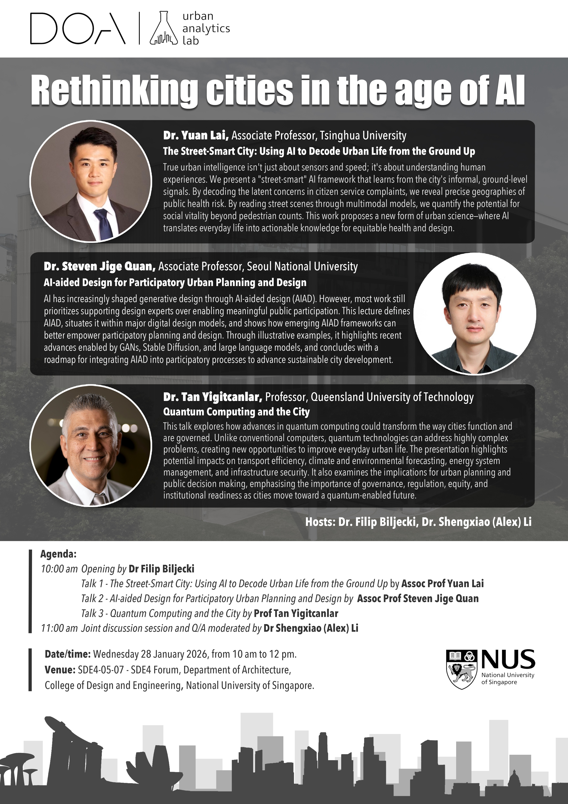
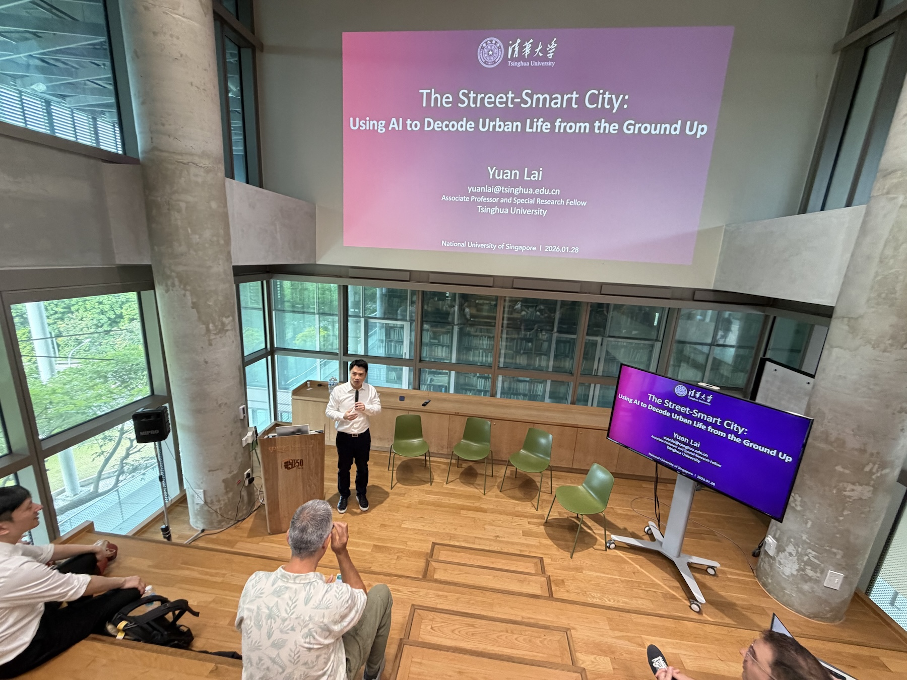
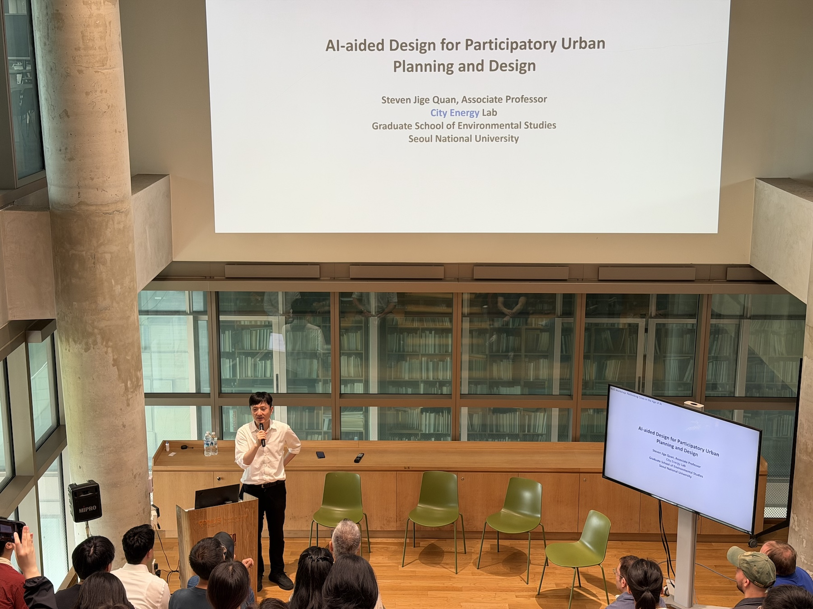
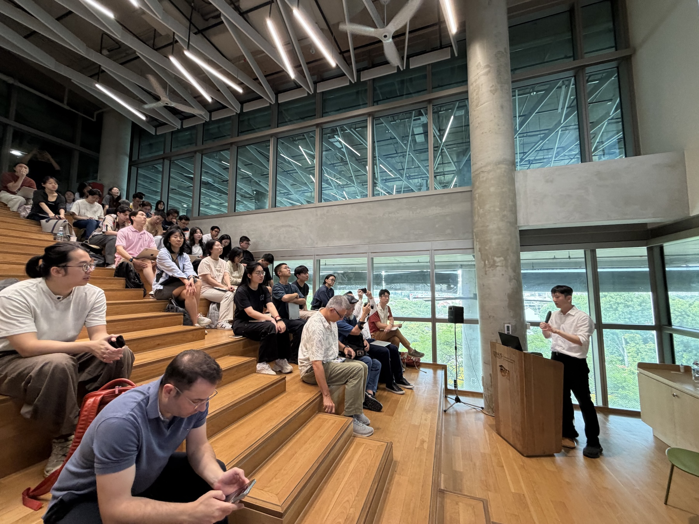
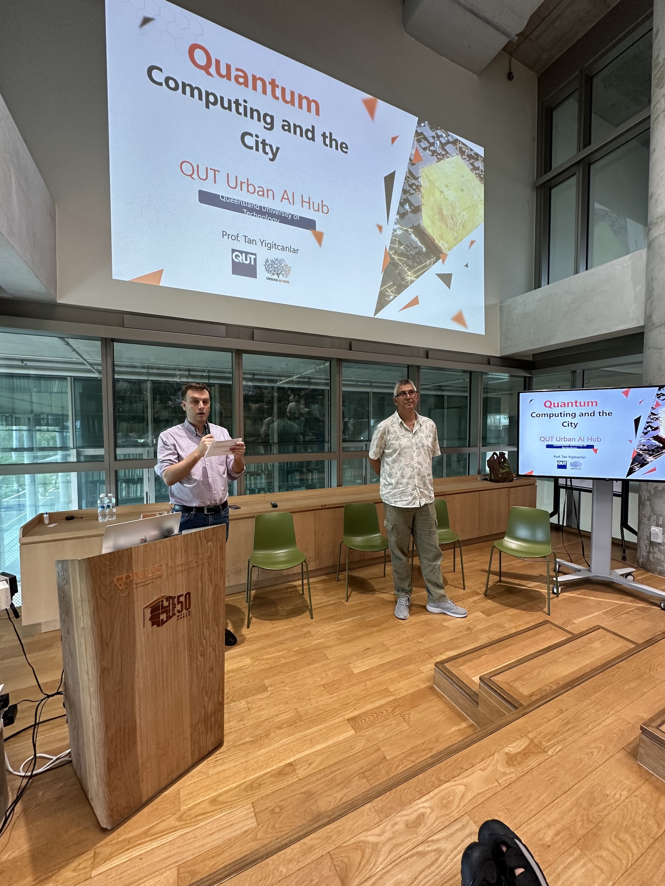
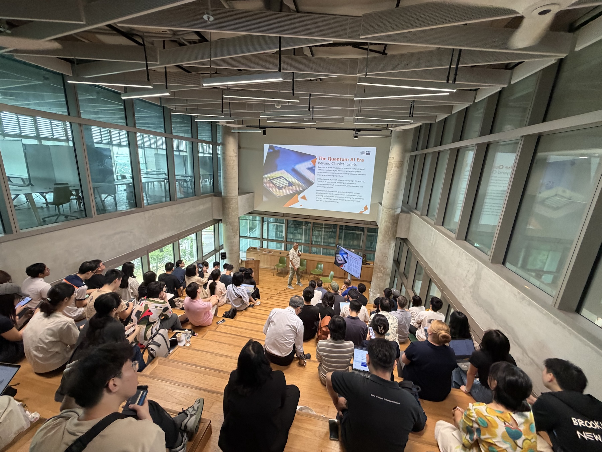
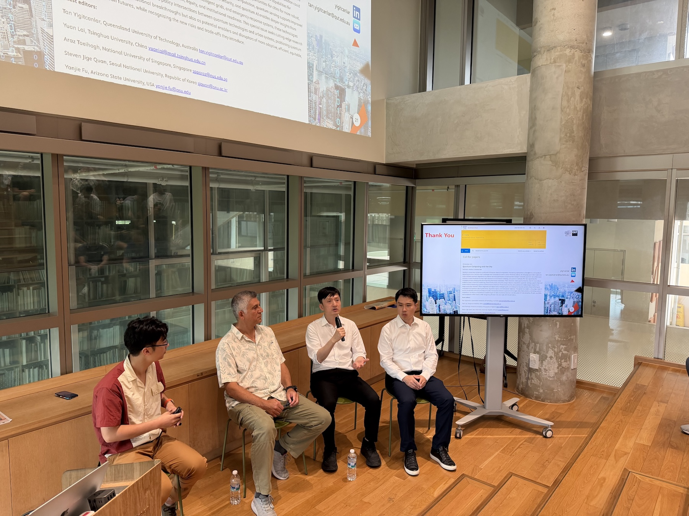
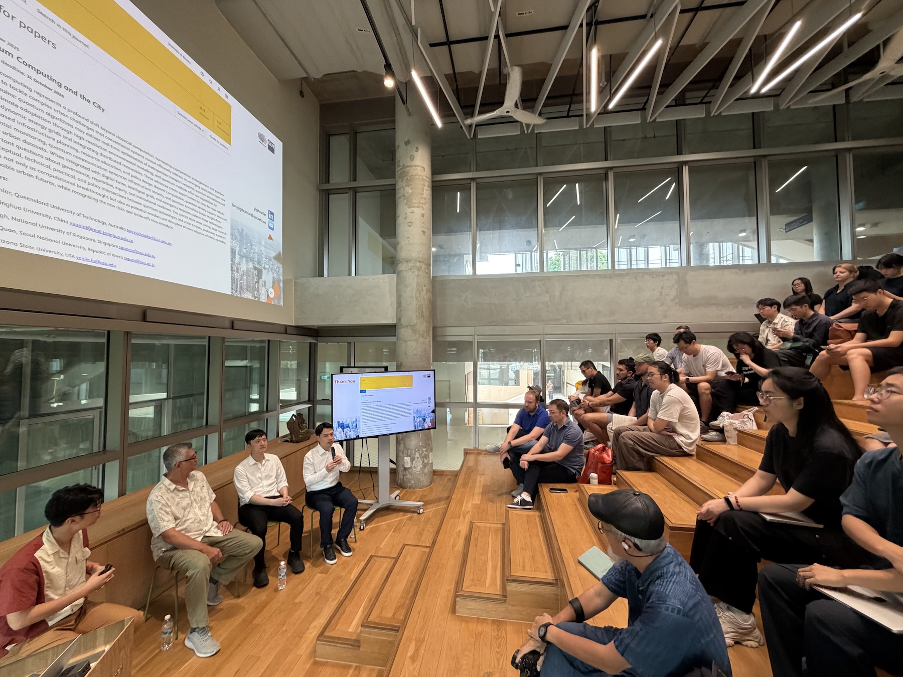

As part of [our series of seminars](/seminars/), we hosted a joint seminar with guests from Australia, Korea, and China:

- The Street-Smart City: Using AI to Decode Urban Life from the Ground Up, by [Assoc Prof Yuan Lai](https://www.arch.tsinghua.edu.cn/info/FUrban%20Planning%20and%20Design/2133), Tsinghua University
- AI-aided Design for Participatory Urban Planning and Design, by [Assoc Prof Steven Jige Quan](https://gses.snu.ac.kr/people/faculty/7), Seoul National University
- Quantum Computing and the City, by [Prof Tan Yigitcanlar](https://www.qut.edu.au/about/our-people/academic-profiles/tan.yigitcanlar), Queensland University of Technology

The event attracted a full lecture room!
Many thanks to our distinguished guest lecturers and everyone for attending.
Our guests have delivered a series of compelling talks followed by an engaging panel session. 

Check out also the special issue [Quantum Computing and the City](https://www.sciencedirect.com/special-issue/328646/quantum-computing-and-the-city) in _Cities_ that our guests are editing.

This session was hosted by {} and [Shengxiao (Alex) Li](https://shengxiaoli.wordpress.com/).

Stay tuned for the upcoming events.
Learn more about our seminars [here](/seminars/).

In the meantime, check out some photos below.

