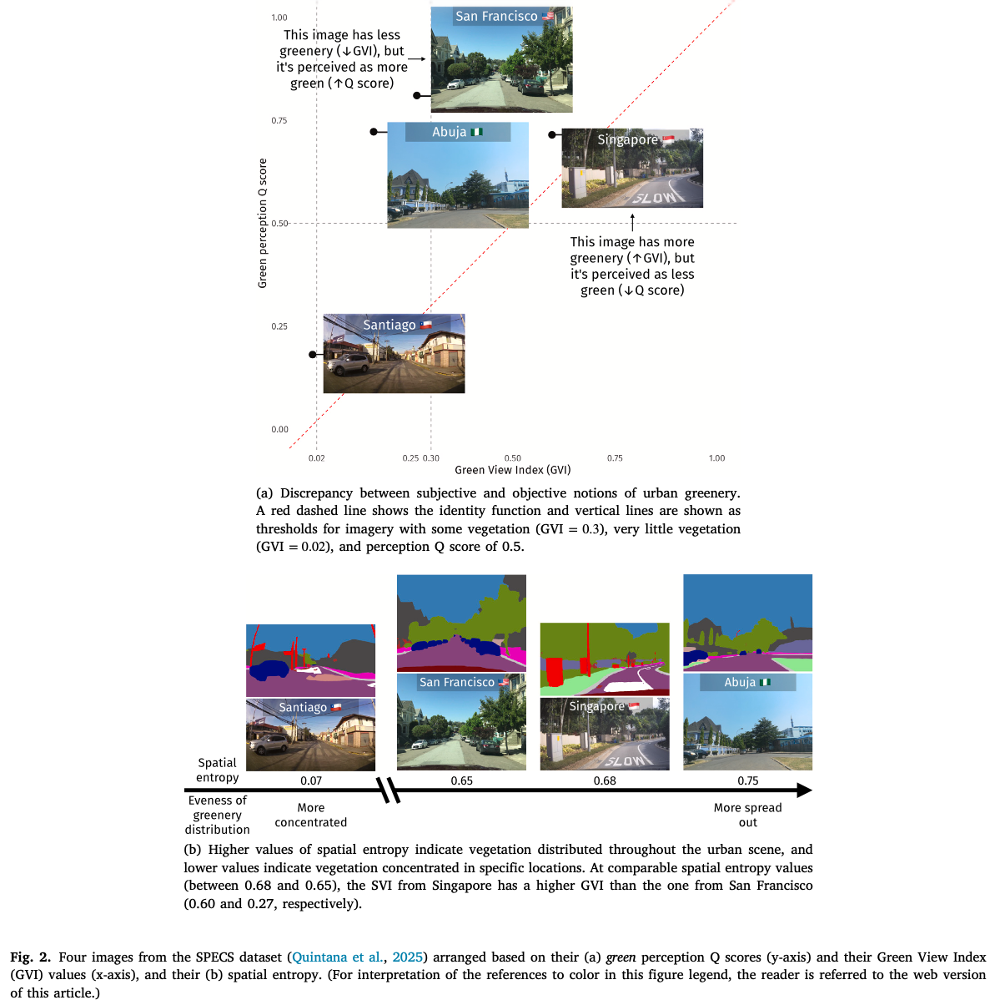
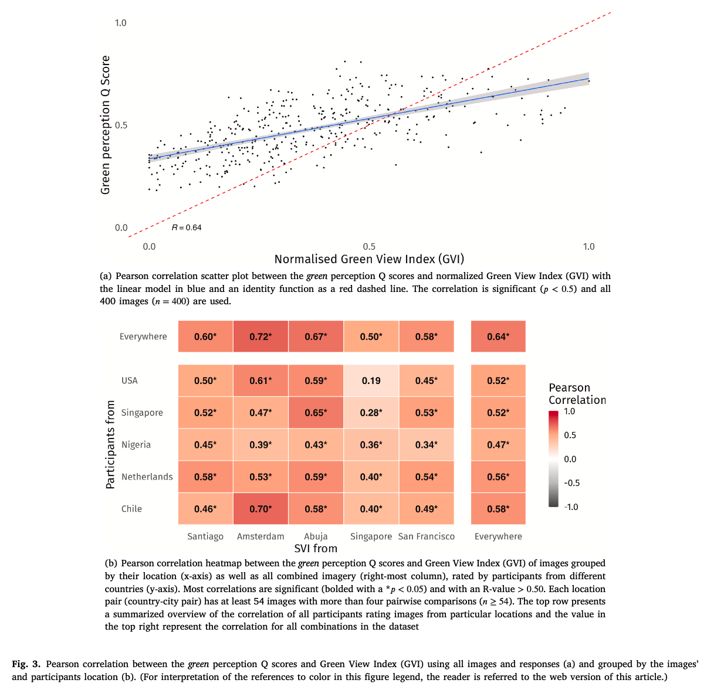
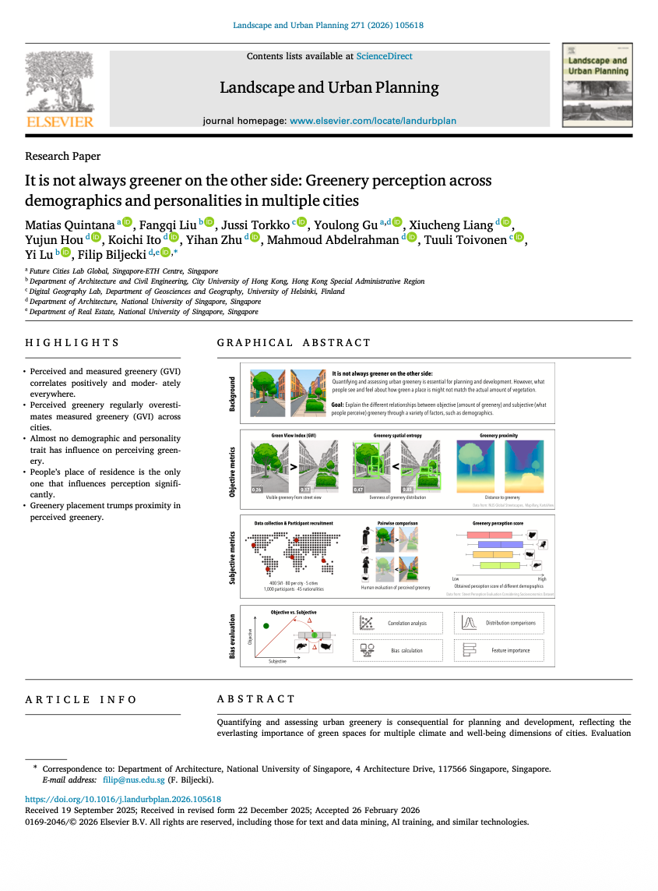

We are glad to share our new paper:

> Quintana M, Liu F, Torkko J, Gu Y, Liang X, Hou Y, Ito K, Zhu Y, Abdelrahman M, Toivonen T, Lu Y, Biljecki F (2026): It is not always greener on the other side: Greenery perception across demographics and personalities in multiple cities. Landscape and Urban Planning, 271: 105618. [<i class="ai ai-doi-square ai"></i> 10.1016/j.landurbplan.2026.105618](https://doi.org/10.1016/j.landurbplan.2026.105618) [<i class="far fa-file-pdf"></i> PDF](/publication/2026-land-greenery/2026-land-greenery.pdf)</i>

This research was led by {}.
It extends his project [SPECS](https://github.com/matqr/specs), which [we featured earlier]().
Congratulations on his new publication! :raised_hands: :clap:

The GitHub repository with the open-source code we developed can be found [here](https://github.com/matqr/greenery-perception).



### Highlights

+ Perceived and measured greenery (GVI) correlates positively and moderately everywhere.
+ Perceived greenery regularly overestimates measured greenery (GVI) across cities.
+ Almost no demographic and personality trait has influence on perceiving greenery.
+ People’s place of residence is the only one that influences perception significantly.
+ Greenery placement trumps proximity in perceived greenery.



### Abstract

> Quantifying and assessing urban greenery is consequential for planning and development, reflecting the everlasting importance of green spaces for multiple climate and well-being dimensions of cities. Evaluation can be broadly grouped into objective (e.g., measuring the amount of greenery) and subjective (e.g., polling the perception of people) approaches, which may differ – what people see and feel about how green a place is might not match the measurements of the actual amount of vegetation. In this work, we advance the state of the art by measuring such differences and explaining them through human, geographic, and spatial dimensions. The experiments rely on contextual information extracted from street view imagery and a comprehensive urban visual perception survey collected from 1000 people across five countries with their extensive demographic and personality information. We analyze the discrepancies between objective measures (e.g., Green View Index (GVI)) and subjective scores (e.g., pairwise ratings), examining whether they can be explained by a variety of human and visual factors such as age group and spatial variation of greenery in the scene. The findings reveal that such discrepancies are comparable around the world and that demographics and personality do not play a significant role in perception. Further, while perceived and measured greenery correlate consistently across geographies (both where people and where imagery are from), where people live plays a significant role in explaining perceptual differences, with these two, as the top among seven, features that influences perceived greenery the most. This location influence suggests that cultural, environmental, and experiential factors substantially shape how individuals observe greenery in cities. We also found that the spatial arrangement of greenery in the sight, rather than its proximity to the person, influences perception. Our study provides a new understanding of the deep relationships between objective and subjective street-level greenery assessments, contributing to a more human-centric design of green urban environments.

### Paper 

For more information, please see the [paper](/publication/2026-land-greenery/).

The paper is [available freely](https://authors.elsevier.com/a/1mjg6cUG5e8ed) until 2026-04-25.

[](/publication/2026-land-greenery/)

BibTeX citation:
```bibtex
@article{2026_land_greenery,
  author = {Quintana, Matias and Liu, Fangqi and Torkko, Jussi and Gu, Youlong and Liang, Xiucheng and Hou, Yujun and Ito, Koichi and Zhu, Yihan and Abdelrahman, Mahmoud and Toivonen, Tuuli and Lu, Yi and Biljecki, Filip},
  doi = {10.1016/j.landurbplan.2026.105618},
  journal = {Landscape and Urban Planning},
  pages = {105618},
  volume = {271},
  title = {It is not always greener on the other side: Greenery perception across demographics and personalities in multiple cities},
  year = {2026}
}
```
