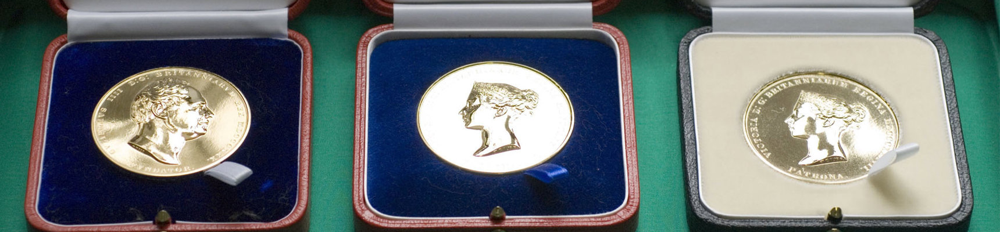

Assistant Professor {} (Department of Architecture) has received the [2026 Gill Memorial Award](https://www.rgs.org/research/higher-education-resources/a-history-of-the-societys-medals-and-awards) from the Royal Geographical Society, recognising outstanding early-career contributions to geographical science.

Asst Prof Biljecki has been honoured for his research work in urban analytics, geospatial data science and digital twins, fields that are transforming how cities can be measured, modelled and understood.

The Gill Memorial Award is presented to early-career researchers who have demonstrated exceptional potential and made significant contributions to geographical science. Named after British explorer Captain William J. Gill, the award was first established in the 1880s and is now presented to researchers who have shown great potential in advancing geographical research.

Asst Prof Biljecki's research develops new ways to sense, analyse and represent cities using large-scale urban data, with applications ranging from urban planning and transport to climate and sustainability.

Leading the Urban Analytics Lab at CDE, much of his work focuses on creating open urban datasets and tools that allow researchers, planners and governments to study how cities function and evolve more effectively. By giving cities a clearer picture of issues such as transport patterns, urban density and environmental conditions, his research supports more informed planning and decision-making in rapidly growing urban environments.

“I am deeply honoured to receive the Gill Memorial Award,” said Asst Prof Biljecki. “The way we sense, measure and understand cities, which is at the heart of my work, is changing quickly. Emerging urban datasets are reshaping geography, and this recognition from a Society that has championed the discipline since 1830 is something I value with great pride.”

He added: “This award is not mine alone; it also reflects the curiosity and hard work of my research group and collaborators.”

The RGS annual medals and awards recognise outstanding contributions across geographical research, teaching, policy and public engagement, with past recipients and medallists including figures such as Sir David Attenborough and Neil Armstrong.

The award will be presented at the Society’s Medals and Awards Ceremony in London in June.

Credit: [NUS College of Design and Engineering](https://cde.nus.edu.sg/news/nus-cde-asst-prof-filip-biljecki-honoured-by-royal-geographic-society/) & [RGS-IBG](https://www.rgs.org/research/higher-education-resources/a-history-of-the-societys-medals-and-awards).
