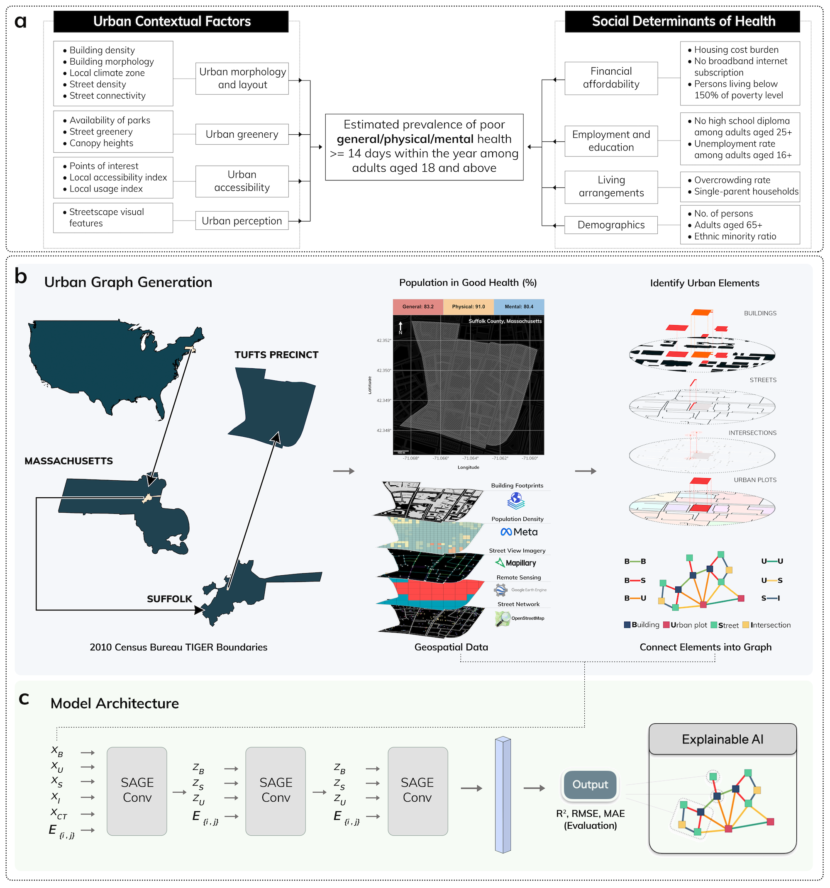
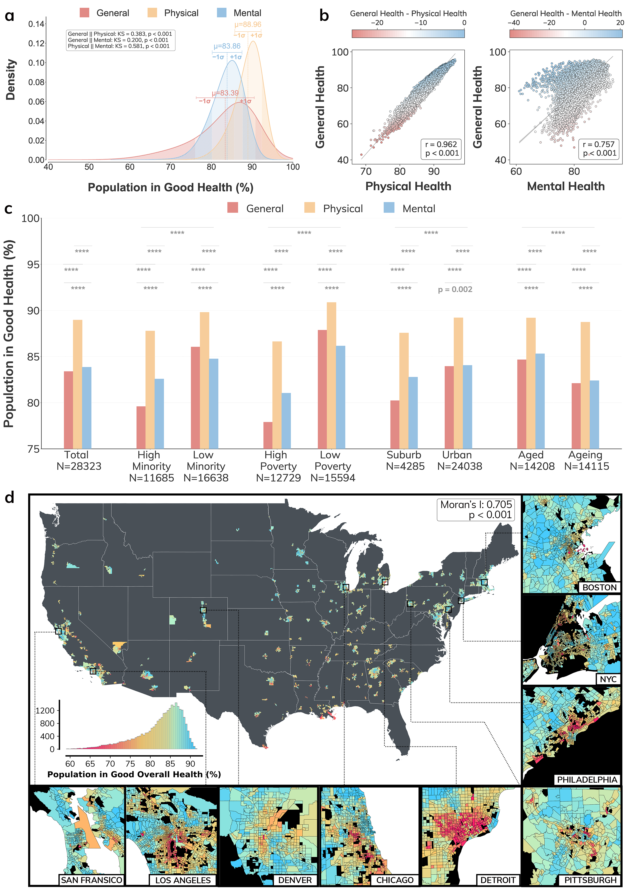
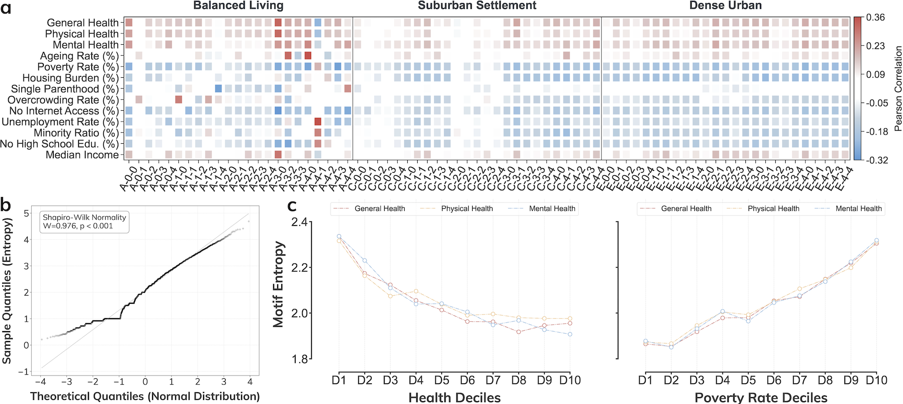
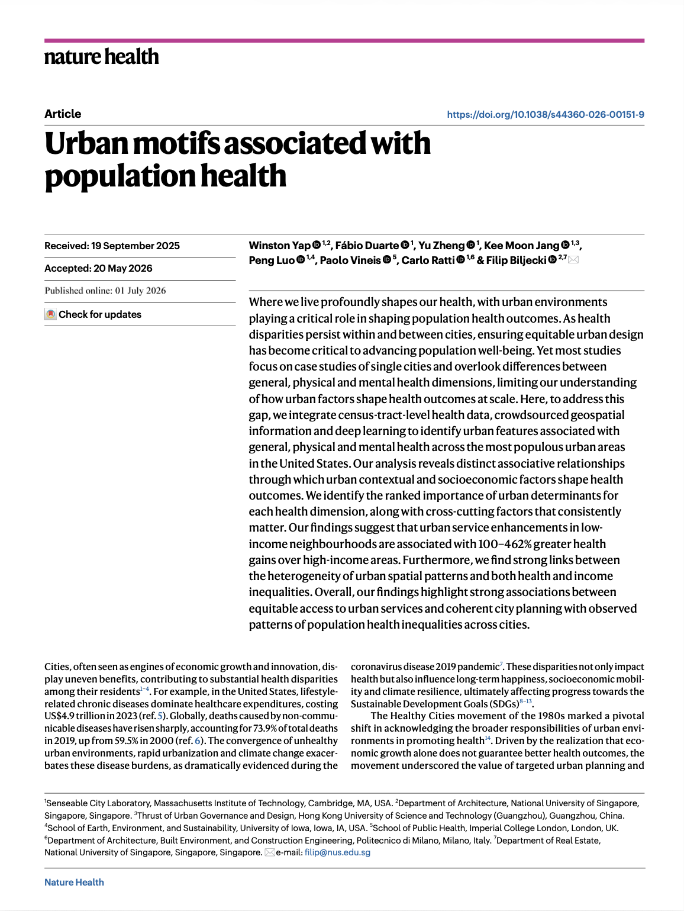

We are glad to share our new paper:

> Yap W, Duarte F, Zheng Y, Jang KM, Luo P, Vineis P, Ratti C, Biljecki F (2026): Urban motifs associated with population health. Nature Health. [<i class="ai ai-doi-square ai"></i> 10.1038/s44360-026-00151-9](https://doi.org/10.1038/s44360-026-00151-9) [<i class="far fa-file-pdf"></i> PDF](/publication/2026-nathealth-motifs/2026-nathealth-motifs.pdf)</i>

This research was led by {}.
Congratulations on this important journal publication! :raised_hands: :clap:

The work was also covered by MIT News in the article [How urban design leads to better wellness](https://news.mit.edu/2026/how-urban-design-leads-to-better-wellness-0701). 








### Abstract

Where we live profoundly shapes our health, with urban environments playing a critical role in shaping population health outcomes. As health disparities persist within and between cities, ensuring equitable urban design has become critical to advancing population well-being. Yet most studies focus on case studies of single cities and overlook differences between general, physical and mental health dimensions, limiting our understanding of how urban factors shape health outcomes at scale. Here, to address this gap, we integrate census-tract-level health data, crowdsourced geospatial information and deep learning to identify urban features associated with general, physical and mental health across the most populous urban areas in the United States. Our analysis reveals distinct associative relationships through which urban contextual and socioeconomic factors shape health outcomes. We identify the ranked importance of urban determinants for each health dimension, along with cross-cutting factors that consistently matter. Our findings suggest that urban service enhancements in low-income neighbourhoods are associated with 100–462% greater health gains over high-income areas. Furthermore, we find strong links between the heterogeneity of urban spatial patterns and both health and income inequalities. Overall, our findings highlight strong associations between equitable access to urban services and coherent city planning with observed patterns of population health inequalities across cities.

### Paper 

For more information, please see the [paper](/publication/2026-nathealth-motifs/).

[](/publication/2026-nathealth-motifs/)

BibTeX citation:
```bibtex
@article{2026_nathealth_motifs,
  author = {Yap, Winston and Duarte, F{\'a}bio and Zheng, Yu and Jang, Kee Moon and Luo, Peng and Vineis, Paolo and Ratti, Carlo and Biljecki, Filip},
  doi = {10.1038/s44360-026-00151-9},
  journal = {Nature Health},
  title = {Urban motifs associated with population health},
  year = {2026}
}
```
