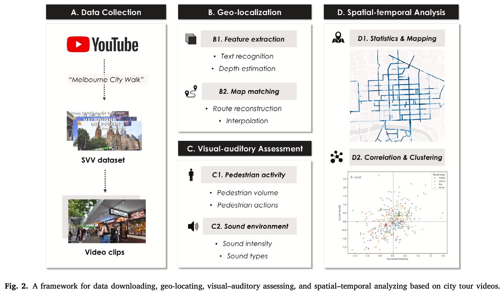
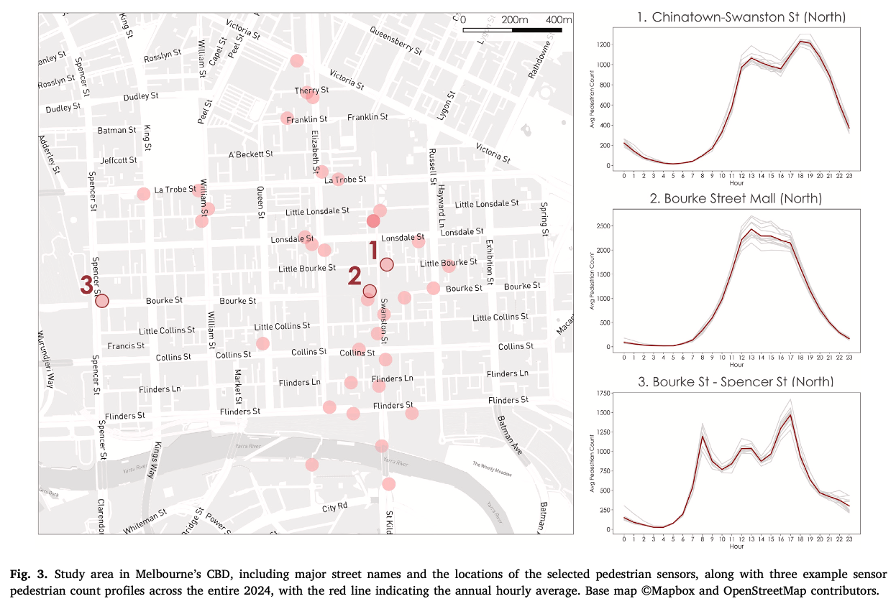
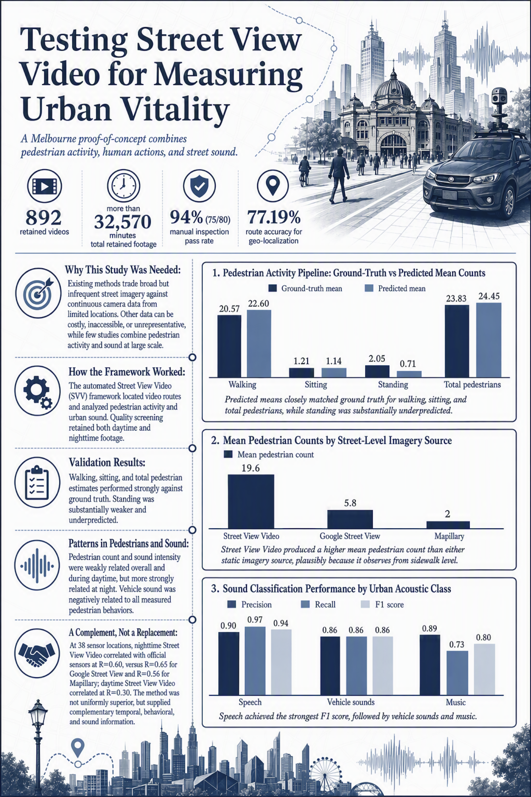
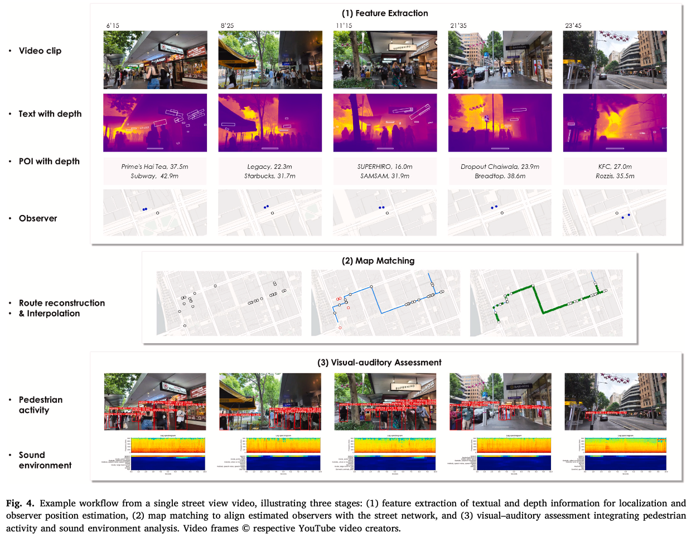
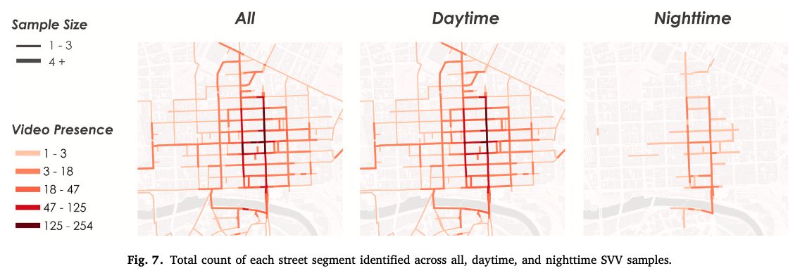
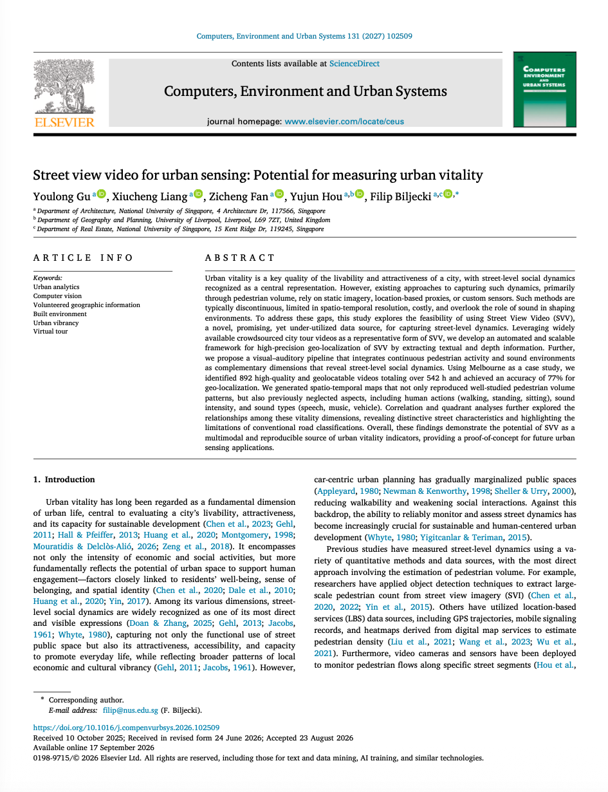

We are glad to share our new paper:

> Gu Y, Liang X, Fan Z, Hou Y, Biljecki F (2027): Street view video for urban sensing: Potential for measuring urban vitality. Computers, Environment and Urban Systems. [<i class="ai ai-doi-square ai"></i> 10.1016/j.compenvurbsys.2026.102509](https://doi.org/10.1016/j.compenvurbsys.2026.102509) [<i class="far fa-file-pdf"></i> PDF](/publication/2027-ceus-svv/2027-ceus-svv.pdf)</i>

This research was led by {}.
Congratulations on this important journal publication! :raised_hands: :clap:





### Video and infographic

Thanks to [ResearchBunny](https://www.researchbunny.com/papers/street-view-video-for-urban-sensing-potential-for-measuring-urban-vitality-akw6?nav=general), we have a video and an infographic about this research:



<figure>
  <a href="infographic.png" target="_blank">
    
  </a>
  <figcaption>Infographic about the work. Courtesy of <a href="https://www.researchbunny.com/papers/street-view-video-for-urban-sensing-potential-for-measuring-urban-vitality-akw6?nav=general">ResearchBunny</a>.</figcaption>
</figure>

Read more about ResearchBunny [here](https://www.researchbunny.com).


### Abstract

Urban vitality is a key quality of the livability and attractiveness of a city, with street-level social dynamics recognized as a central representation. However, existing approaches to capturing such dynamics, primarily through pedestrian volume, rely on static imagery, location-based proxies, or custom sensors. Such methods are typically discontinuous, limited in spatio-temporal resolution, costly, and overlook the role of sound in shaping environments. To address these gaps, this study explores the feasibility of using Street View Video (SVV), a novel, promising, yet under-utilized data source, for capturing street-level dynamics. Leveraging widely available crowdsourced city tour videos as a representative form of SVV, we develop an automated and scalable framework for high-precision geo-localization of SVV by extracting textual and depth information. Further, we propose a visual–auditory pipeline that integrates continuous pedestrian activity and sound environments as complementary dimensions that reveal street-level social dynamics. Using Melbourne as a case study, we identified 892 high-quality and geolocatable videos totaling over 542 h and achieved an accuracy of 77% for geo-localization. We generated spatio-temporal maps that not only reproduced well-studied pedestrian volume patterns, but also previously neglected aspects, including human actions (walking, standing, sitting), sound intensity, and sound types (speech, music, vehicle). Correlation and quadrant analyses further explored the relationships among these vitality dimensions, revealing distinctive street characteristics and highlighting the limitations of conventional road classifications. Overall, these findings demonstrate the potential of SVV as a multimodal and reproducible source of urban vitality indicators, providing a proof-of-concept for future urban sensing applications.





### Paper 

For more information, please see the [paper](/publication/2027-ceus-svv/).

[](/publication/2027-ceus-svv/)

BibTeX citation:
```bibtex
@article{2027_ceus_svv,
  author = {Gu, Youlong and Liang, Xiucheng and Fan, Zicheng and Hou, Yujun and Biljecki, Filip},
  doi = {10.1016/j.compenvurbsys.2026.102509},
  journal = {Computers, Environment and Urban Systems},
  pages = {102509},
  title = {Street view video for urban sensing: Potential for measuring urban vitality},
  volume = {131},
  year = {2027}
}
```
