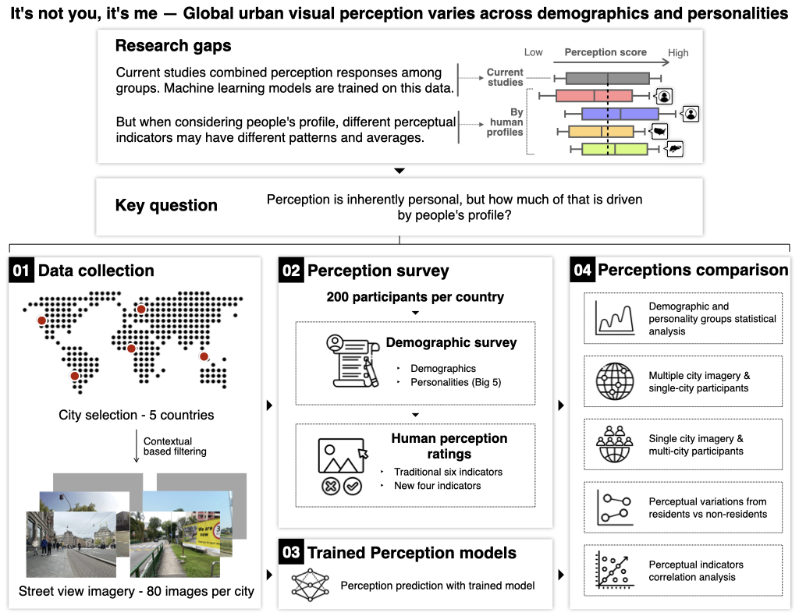

# A massive urban visual perception survey including 1000 people globally, with their demographic and personality data

SPECS, led by {}, is a big dataset on visual perception that we have collected to understand how demographics and personality drive the visual perception of streetscapes.

A [paper](https://doi.org/10.1038/s44284-025-00330-x) describing the dataset and its analysis has been published in _Nature Cities_.
The dataset is available on [Hugging Face](https://huggingface.co/datasets/matiasqr/specs).
The code is openly available on [GitHub](https://github.com/matqr/specs).



## Paper and attribution

A [paper](https://doi.org/10.1038/s44284-025-00330-x) describing the project was published in _Nature Cities_.
Please refer to it for detailed information.

If you use SPECS in a scientific context, please cite the paper:

> Quintana M, Gu Y, Liang X, Hou Y, Ito K, Zhu Y, Abdelrahman M, Biljecki F (2025): Global urban visual perception varies across demographics and personalities. Nature Cities. [<i class="ai ai-doi-square ai"></i> 10.1038/s44284-025-00330-x](https://doi.org/10.1038/s44284-025-00330-x) [<i class="far fa-file-pdf"></i> PDF](/publication/2025-natcities-specs/2025-natcities-specs.pdf)</i>

```bibtex
@article{2025_natcities_specs,
  author = {Quintana, Matias and Gu, Youlong and Liang, Xiucheng and Hou, Yujun and Ito, Koichi and Zhu, Yihan and Abdelrahman, Mahmoud and Biljecki, Filip},
  doi = {10.1038/s44284-025-00330-x},
  journal = {Nature Cities},
  title = {Global urban visual perception varies across demographics and personalities},
  year = {2025}
}
```


## Authors / Research group

The project was led by {} and conducted in the [Future Cities Lab Global](https://futurecitieslab.world) at the Singapore-ETH Centre and the [Urban Analytics Lab](/) at the National University of Singapore (NUS).
The full list of people involved is listed in the paper.

## Funding and Acknowledgements

We thank the survey participants from around the world for their time and responses.
The authors also thank Annette Gloria Fernandez, Felix Hammer, and Stella Morgenstern for the initial discussions and Milieu Insight Pte Ltd for the data collection work.
This research was conducted at the Future Cities Lab Global at Singapore-ETH Centre. 
Future Cities Lab Global is supported and funded by the National Research Foundation, Prime Minister's Office, Singapore under its Campus for Research Excellence and Technological Enterprise (CREATE) programme and ETH Z\"urich (ETHZ), with additional contributions from the National University of Singapore (NUS), Nanyang Technological University (NTU), Singapore and the Singapore University of Technology and Design (SUTD) (M.Q., Y.G., F.B.).
This research supported by the Singapore International Graduate Award (SINGA) scholarship provided by the Agency for Science, Technology, and Research (A*STAR) (K.I), the NUS Graduate Research Scholarship (X.L), and the NUS (Y.Z).
This research is part of the project Multi-scale Digital Twins for the Urban Environment: From Heartbeats to Cities, which is supported by the Singapore Ministry of Education Academic Research Fund Tier 1 (M.A., F.B.).
This research is part of the project Large-scale 3D Geospatial Data for Urban Analytics, which is supported by the National University of Singapore under the Start Up Grant R-295-000-171-133 (Y.H., F.B.).
