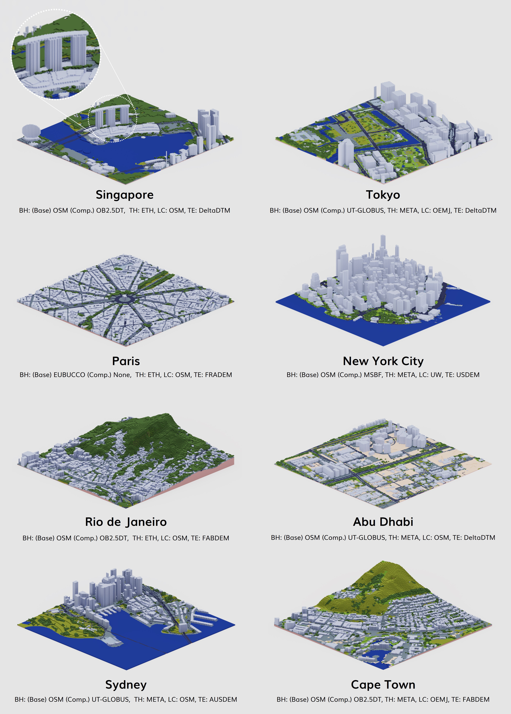

# A one-stop Python package for open geospatial data integration, 3D city model generation, and urban environment simulation

VoxCity, developed by {}, is a Python package that provides a seamless solution for grid-based 3D city model generation and urban simulation for cities worldwide. VoxCity's generator module automatically downloads building heights, tree canopy heights, land cover, and terrain elevation within a specified target area, and voxelizes buildings, trees, land cover, and terrain to generate an integrated voxel city model. The simulator module enables users to conduct environmental simulations, including solar radiation and view index analyses. Users can export the generated models using several file formats compatible with external software, such as ENVI-met (INX), Blender, and Rhino (OBJ).

The Github repository is available [here](https://github.com/kunifujiwara/VoxCity), and it is supported by a Google Colab and documentation.





## Paper and attribution

A [paper](https://doi.org/10.1016/j.compenvurbsys.2025.102366) describing the development has been published in _Computers, Environment and Urban Systems_.
Please refer to it for detailed information.

If you use VoxCity in a scientific context, please cite the paper:

> Fujiwara K, Tsurumi R, Kiyono T, Fan Z, Liang X, Lei B, Yap W, Ito K, Biljecki F (2026): VoxCity: A seamless framework for open geospatial data integration, grid-based semantic 3D city model generation, and urban environment simulation. Computers, Environment and Urban Systems 123: 102366. [<i class="ai ai-doi-square ai"></i> 10.1016/j.compenvurbsys.2025.102366](https://doi.org/10.1016/j.compenvurbsys.2025.102366) [<i class="far fa-file-pdf"></i> PDF](/publication/2026-ceus-voxcity/2026-ceus-voxcity.pdf)</i> <i class="ai ai-open-access-square ai"></i>

```bibtex
@article{2026_ceus_voxcity,
  author = {Fujiwara, Kunihiko and Tsurumi, Ryuta and Kiyono, Tomoki and Fan, Zicheng and Liang, Xiucheng and Lei, Binyu and Yap, Winston and Ito, Koichi and Biljecki, Filip},
  doi = {10.1016/j.compenvurbsys.2025.102366},
  journal = {Computers, Environment and Urban Systems},
  pages = {102366},
  title = {VoxCity: A seamless framework for open geospatial data integration, grid-based semantic 3D city model generation, and urban environment simulation},
  volume = {123},
  year = {2026}
}
```

## Authors / Research group

The project was led by {} and conducted in the [Urban Analytics Lab](/) at the National University of Singapore (NUS) and in collaboration with Takenaka Corporation.
The full list of people involved is listed in the paper.

## Funding and Acknowledgements

This research has been supported by Takenaka Corporation.
This research is part of the projects (i) Large-scale 3D Geospatial Data for Urban Analytics, which is supported by the National University of Singapore under the Start Up Grant; and (ii) Multi-scale Digital Twins for the Urban Environment: From Heartbeats to Cities, which is supported by the Singapore Ministry of Education Academic Research Fund Tier 1.
We would like to thank the Singapore International Graduate Award (SINGA) scholarship provided by the Agency for Science, Technology, and Research (A*STAR), and NUS Research Scholarship and the President’s Graduate Fellowship (PGF) provided by NUS.

