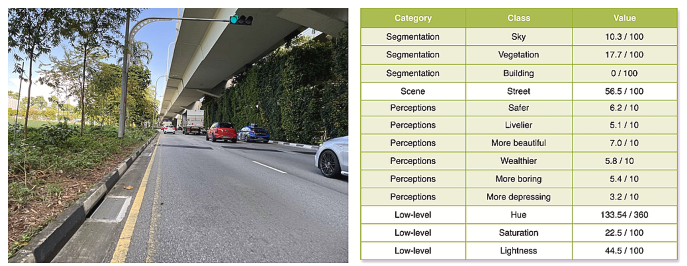
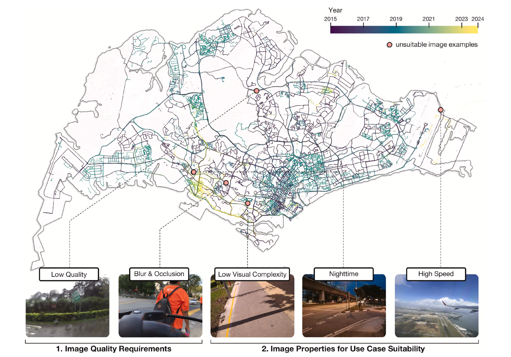

# An open-source Python package to streamline projects relying on Street View Imagery, from their download to analysis

ZenSVI has been developed by {} to facilitate the entire process of street view imagery analytics and supporting a wide range of use cases.
A [software paper](https://doi.org/10.1016/j.compenvurbsys.2025.102283) describing the development has been published CEUS.

This package is openly available on [GitHub](https://github.com/koito19960406/ZenSVI), and it is supported by [documentation including tutorials](https://zensvi.readthedocs.io/en/latest/index.html).

 download, 2) metadata analysis, 3) computer vision, 4) image transformation, and 5) visualization.")

Its functionality covers:
- Seamless street view image acquisition
- Advanced image transformations (panorama to fish-eye and more)
- Integrated computer vision models for semantic segmentation, scene classification, and many more
- Visualization tools for mapping and analyzing results

Here are a few examples of use cases:
- Compare urban greenery metrics across neighborhoods and cities
- Track gentrification patterns through visual environmental changes
- Monitor transportation mode preferences over time
- Validate the quality of crowdsourced street imagery





 primarily follows major highways, Cluster 2 (red) concentrates in dense urban areas and town centers, Cluster 3 (green) follows green corridors, while Clusters 4 (light green) and 5 (light blue) represent different types of residential areas distributed throughout the city.")


## Paper and attribution

A [paper](https://doi.org/10.1016/j.compenvurbsys.2025.102283) describing the project was published in _Computers, Environment and Urban Systems_.
Please refer to it for detailed information.

If you use ZenSVI in a scientific context, please cite the paper:

> Ito K, Zhu Y, Abdelrahman M, Liang X, Fan Z, Hou Y, Zhao T, Ma R, Fujiwara K, Ouyang J, Quintana M, Biljecki F (2025): ZenSVI: An open-source software for the integrated acquisition, processing and analysis of street view imagery towards scalable urban science. _Computers, Environment and Urban Systems_ 119: 102283.
> [<i class="ai ai-doi-square ai"></i>10.1016/j.compenvurbsys.2025.102283](https://doi.org/10.1016/j.compenvurbsys.2025.102283) [<i class="far fa-file-pdf"></i> PDF](/publication/2025-ceus-zensvi/2025-ceus-zensvi.pdf)</i>

```bibtex
@article{2025_ceus_zensvi,
  author = {Ito, Koichi and Zhu, Yihan and Abdelrahman, Mahmoud and Liang, Xiucheng and Fan, Zicheng and Hou, Yujun and Zhao, Tianhong and Ma, Rui and Fujiwara, Kunihiko and Ouyang, Jiani and Quintana, Matias and Biljecki, Filip},
  doi = {10.1016/j.compenvurbsys.2025.102283},
  journal = {Computers, Environment and Urban Systems},
  pages = {102283},
  title = {ZenSVI: An open-source software for the integrated acquisition, processing and analysis of street view imagery towards scalable urban science},
  volume = {119},
  year = {2025}
}
```


## Authors / Research group

The project was led by {} and conducted in the [Urban Analytics Lab](/) at the National University of Singapore (NUS).
The full list of people involved is listed in the paper.

## Funding and Acknowledgements

This research was funded by the Singapore International Graduate Award (SINGA) scholarship provided by the Agency for Science, Technology, and Research (A*STAR), the NUS Graduate Research Scholarship, and the President’s Graduate Fellowship, all granted by the National University of Singapore (NUS).
This research has been supported by Takenaka Corporation.
This research has been supported by the Research Activities Fund of City University of Hong Kong.
This research is part of the project Large-scale 3D Geospatial Data for Urban Analytics, which is supported by the National University of Singapore under the Start Up Grant R-295-000-171-133.
This research is part of the project Multi-scale Digital Twins for the Urban Environment: From Heartbeats to Cities, which is supported by the Singapore Ministry of Education Academic Research Fund Tier 1.
The research was partially conducted at the Future Cities Lab Global at the Singapore-ETH Centre, which was established collaboratively between ETH Zürich and the National Research Foundation Singapore (NRF) under its Campus for Research Excellence and Technological Enterprise (CREATE) programme.
We express our gratitude to the members of the NUS Urban Analytics Lab for their valuable discussions and insights.
We would like to thank the developers of the open-source software packages that made ZenSVI possible.
We also acknowledge the contributors of OpenStreetMap, Mapillary, and KartaView, and other platforms, for providing valuable open data resources that support street-level imagery research and applications.
